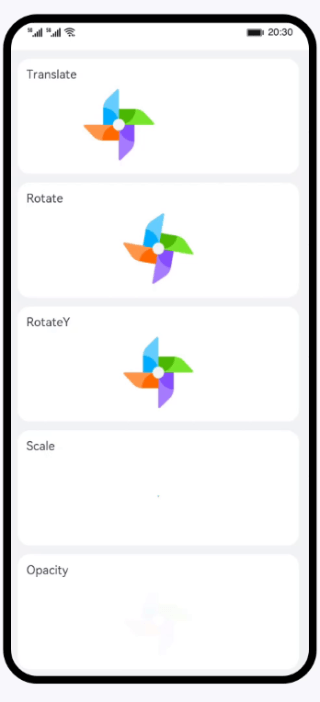

# 动画样式（JS）
### 简介
本篇Codelab使用动画样式，实现几种常见动画效果：平移、旋转、缩放以及透明度变化。效果如图所示：

### 相关概念
- [自定义组件](https://developer.harmonyos.com/cn/docs/documentation/doc-references-V3/js-components-custom-basic-usage-0000001477981289-V3)：自定义组件是用户根据业务需求，将已有的组件组合，封装成的新组件，可以在工程中多次调用，从而提高代码的可读性。
- [动画样式](https://developer.harmonyos.com/cn/docs/documentation/doc-references-V3/js-components-common-animation-0000001477981245-V3)：组件支持动态的旋转、平移、缩放效果，可在style或css中设置。
### 相关权限
不涉及
### 使用说明
1. 打开动画样式（JS）应用，页面展示几种常见动画效果。
### 约束与限制
1. 本示例仅支持标准系统上运行，支持设备：华为手机或运行在DevEco Studio上的华为手机设备模拟器。
2. 本示例为FA模型，支持API Version 9。
3. 本示例需要使用DevEco Studio 3.1 Release版本进行编译运行。
