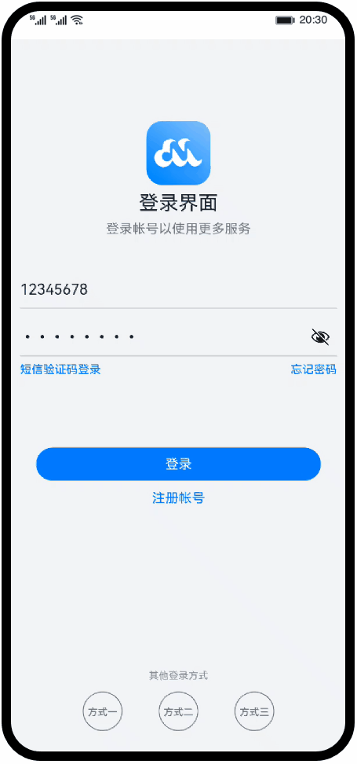

# 常用组件与布局（ArkTS）

### 简介

HarmonyOS ArkUI提供了丰富多样的UI组件，您可以使用这些组件轻松地编写出更加丰富、漂亮的界面。在本篇Codelab中，您将通过一个简单的购物社交应用示例，学习如何使用常用的基础组件和容器组件。本示例主要包含：“登录”、“首页”、“我的”三个页面。效果图如下：

### 相关概念

- [Text](https://developer.harmonyos.com/cn/docs/documentation/doc-references/ts-basic-components-text-0000001333720953)：显示一段文本的组件。

- [Image](https://developer.harmonyos.com/cn/docs/documentation/doc-references/ts-basic-components-image-0000001281001226)：图片组件，支持本地图片和网络图片的渲染展示。

- [TextInput](https://developer.harmonyos.com/cn/docs/documentation/doc-references/ts-basic-components-textinput-0000001333321201)：可以输入单行文本并支持响应输入事件的组件。

- [Button](https://developer.harmonyos.com/cn/docs/documentation/doc-references/ts-basic-components-button-0000001281480682)：按钮组件，可快速创建不同样式的按钮。

- [LoadingProgress](https://developer.harmonyos.com/cn/docs/documentation/doc-references/ts-basic-components-loadingprogress-0000001281361106)：用于显示加载动效的组件。

- [Flex](https://developer.harmonyos.com/cn/docs/documentation/doc-references/ts-container-flex-0000001281001250)：应用弹性方式布局子组件的容器组件。

- [Column](https://developer.harmonyos.com/cn/docs/documentation/doc-references/ts-container-column-0000001333641085)：沿垂直方向布局的容器。

- [Row](https://developer.harmonyos.com/cn/docs/documentation/doc-references/ts-container-row-0000001281480714)：沿水平方向布局容器。

- [List](https://developer.harmonyos.com/cn/docs/documentation/doc-references/ts-container-list-0000001333800573)：列表包含一系列相同宽度的列表项。适合连续、多行呈现同类数据，例如图片和文本。

- [Swiper](https://developer.harmonyos.com/cn/docs/documentation/doc-references/ts-container-swiper-0000001333321221)：滑动容器，提供切换子组件显示的能力。

- [Grid](https://developer.harmonyos.com/cn/docs/documentation/doc-references/ts-container-grid-0000001281480710)：网格容器，由“行”和“列”分割的单元格所组成，通过指定“项目”所在的单元格做出各种各样的布局。

### 相关权限

不涉及

### 使用说明

1. 在登录界面输入账号和密码（任意字符），点击登录按钮跳转到应用首页。
2. 点击底部的Tabs，界面在“首页”和“我的”之间进行切换。

### 约束与限制

1. 本示例仅支持标准系统上运行，支持设备：华为手机或运行在DevEco Studio上的华为手机设备模拟器。
2. 本示例为Stage模型，支持API version 9及以上版本SDK。
3. 本示例需要使用DevEco Studio 3.1 Beta2及以上版本进行编译运行。