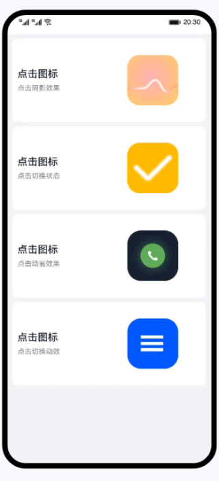

# image、image-animator组件的使用（JS）
### 简介
HarmonyOS提供了常用的图片、图片帧动画播放器组件，开发者可以根据实际场景和开发需求，实现不同的界面交互效果，包括：点击阴影效果、点击切换状态、点击动画效果、点击切换动效。

### 相关概念 

-   [image组件](https://developer.harmonyos.com/cn/docs/documentation/doc-references-V3/js-components-basic-image-0000001427744884-V3?catalogVersion=V3)：图片组件，用于图片资源的展示。
-   [image-animitor组件](https://developer.harmonyos.com/cn/docs/documentation/doc-references-V3/js-components-basic-image-animator-0000001478181473-V3?catalogVersion=V3)：帧动画播放器，用以播放一组图片，可以设置播放时间、次数等参数。
-   [通用事件](https://developer.harmonyos.com/cn/docs/documentation/doc-references-V3/js-components-common-events-0000001478341193-V3?catalogVersion=V3)：事件绑定在组件上，当组件达到事件触发条件时，会执行JS中对应的事件回调函数，实现页面UI视图和页面JS逻辑层的交互。

### 相关权限

不涉及

### 使用说明
1. 手指长按第一个图标不松手，会出现黑色边框。
2. 点击第二个图标，图标会来回切换。
3. 点击第三个图标，会出现放大缩小的动画效果。
4. 点击第四个图标，图标会旋转变换为“箭头”或“可扩展”图标。

### 约束与限制
1. 本示例仅支持标准系统上运行，支持设备：华为手机或运行在DevEco Studio上的华为手机设备模拟器。
2. 本示例为FA模型，支持API version 9及以上版本SDK。
3. 本示例需要使用DevEco Studio 3.1 Release及以上版本进行编译运行。