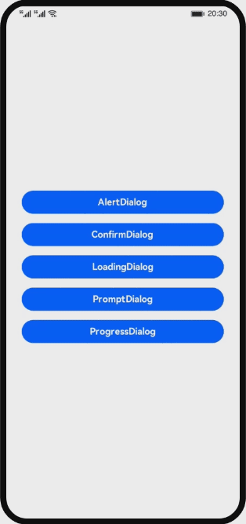

# 弹窗基本使用（JS）

### 简介
基于dialog和button组件，实现dialog的几种常见效果。

### **相关概念**
* [dialog](https://developer.harmonyos.com/cn/docs/documentation/doc-references-V3/js-components-container-dialog-0000001477981249-V3)组件：自定义弹窗容器组件。
* [button](https://developer.harmonyos.com/cn/docs/documentation/doc-references-V3/js-service-widget-basic-button-0000001428061848-V3)组件：按钮组件。

### 相关权限
不涉及

### 使用说明
1. 通过dialog容器组件自定义弹窗样式，主要包括AlertDialog、ConfirmDialog、LoadingDialog、PromptDialog以及ProgressDialog。

### 约束与限制
1. 本示例仅支持标准系统上运行，支持设备：华为手机或运行在DevEco Studio上的华为手机设备模拟器。
2. 本示例为FA模型，支持API version 9。
3. 本示例需要使用DevEco Studio 3.1 Release版本进行编译运行。