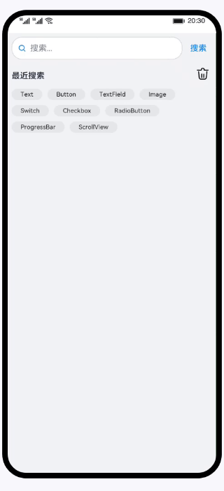

# 弹性布局（ArkTS）

### 简介

基于Flex容器组件特性，实现弹性布局效果。效果如图所示：

### 相关概念

- [Flex组件](https://developer.harmonyos.com/cn/docs/documentation/doc-references-V3/ts-container-flex-0000001427902472-V3?catalogVersion=V3)：以弹性方式布局子组件的容器组件。
- [Search组件](https://developer.harmonyos.com/cn/docs/documentation/doc-references-V3/ts-basic-components-search-0000001428061740-V3?catalogVersion=V3)：搜索框组件，适用于浏览器的搜索内容输入框等应用场景。
- [Text组件](https://developer.harmonyos.com/cn/docs/documentation/doc-references-V3/ts-basic-components-text-0000001477981201-V3?catalogVersion=V3)：显示一段文本的组件。
- [Image组件](https://developer.harmonyos.com/cn/docs/documentation/doc-references-V3/ts-basic-components-image-0000001428061728-V3?catalogVersion=V3)：图片组件，支持本地图片和网络图片的渲染展示。
- [Scroll](https://developer.harmonyos.com/cn/docs/documentation/doc-references-V3/ts-container-scroll-0000001427902480-V3?catalogVersion=V3)：可滑动的容器组件，当子组件的布局尺寸超过父组件的视口时，内容可以滑动。
- [条件渲染](https://developer.harmonyos.com/cn/docs/documentation/doc-guides-V3/arkts-rendering-control-ifelse-0000001524177637-V3?catalogVersion=V3)：条件渲染可根据应用的不同状态，使用if、else和else if渲染对应状态下的UI内容。
- [循环渲染](https://developer.harmonyos.com/cn/docs/documentation/doc-guides-V3/arkts-rendering-control-foreach-0000001524537153-V3?catalogVersion=V3)：ForEach基于数组类型数据执行循环渲染。

### 相关权限

不涉及

### 使用说明

1. 在页面的搜索输入框中输入搜索的文本内容，点击**搜索**文本按钮，最近搜索内容中展示刚输入搜索的文本内容。
2. 点击**删除**图标，所有最近搜索内容清空，并展示没有搜索内容文本和相关图片。

### 约束与限制

1. 本示例仅支持标准系统上运行，支持设备：华为手机或运行在DevEco Studio上的华为手机设备模拟器。
2. 本示例为Stage模型，支持API version 9。
3. 本示例需要使用DevEco Studio 3.1 Release版本进行编译运行。