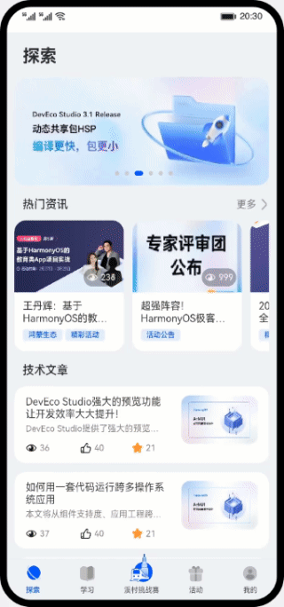

# HarmonyOS世界

### 简介

基于分层架构和模块化设计的最佳实践，实现一个HarmonyOS赋能应用。

### 相关概念

- [@State](https://developer.harmonyos.com/cn/docs/documentation/doc-guides-V3/arkts-state-0000001474017162-V3)：应用程序内组件状态所使用的装饰器，用于建立状态与UI渲染之间的驱动关系，当状态改变时，UI会发生对应的渲染改变。
- [@Prop](https://developer.harmonyos.com/cn/docs/documentation/doc-guides-V3/arkts-prop-0000001473537702-V3?catalogVersion=V3)：用于子组件接受父组件的状态变量，其接受数据源的变化，并响应UI刷新。
- [@Link](https://developer.harmonyos.com/cn/docs/documentation/doc-guides-V3/arkts-link-0000001524297305-V3?catalogVersion=V3)：用于子组件接受父组件的状态变量，与Prop的区别在于，Link装饰变量的修改能够返回给数据源，常用于一些数据频繁变化，需要修改相应数据源的场景。
- [@Provide和@Consume](https://developer.harmonyos.com/cn/docs/documentation/doc-guides-V3/arkts-provide-and-consume-0000001473857338-V3)：@Provide和@Consume，应用于父级与后代组件的双向数据同步，状态数据在跨多个层级传递的场景。
- [@Observed和@ObjectLink](https://developer.harmonyos.com/cn/docs/documentation/doc-guides-V3/arkts-observed-and-objectlink-0000001473697338-V3)：@ObjectLink和@Observed类装饰器用于在涉及嵌套对象或数组的场景中进行双向数据同步，其中@Observed用于装饰类，@ObjectLink在页面使用，用于实现双向同步。
- [AppStorage](https://developer.harmonyos.com/cn/docs/documentation/doc-guides-V3/arkts-appstorage-0000001524417209-V3)：应用程序中的单例对象，为应用程序范围内的可变状态属性提供中央存储。
- [首选项](https://developer.harmonyos.com/cn/docs/documentation/doc-guides-V3/data-persistence-by-preferences-0000001505432513-V3?catalogVersion=V3)：首选项为应用提供Key-Value键值型的数据处理能力，支持应用持久化轻量级数据，并对其修改和查询。
- [EventHub](https://developer.harmonyos.com/cn/docs/documentation/doc-references-V3/js-apis-inner-application-eventhub-0000001477981377-V3?catalogVersion=V3)：EventHub模块提供了事件中心，提供订阅、取消订阅、触发事件的能力。
- [HSP动态共享包](https://developer.harmonyos.com/cn/docs/documentation/doc-guides-V3/in-app-hsp-0000001523312158-V3)：应用内HSP指的是专门为某一应用开发的HSP，只能被该应用内部其他HAP/HSP使用，用于应用内部代码、资源的共享。

### 相关权限

本篇Codelab使用了网络请求，需要在配置文件module.json5里添加相关权限：
- 网络权限：[ohos.permission.INTERNET](https://developer.harmonyos.com/cn/docs/documentation/doc-guides-V3/permission-list-0000001544464017-V3#ZH-CN_TOPIC_0000001523648786__ohospermissioninternet)。
- 数据网络信息权限：[ohos.permission.GET_NETWORK_INFO](https://developer.harmonyos.com/cn/docs/documentation/doc-guides-V3/permission-list-0000001544464017-V3#ZH-CN_TOPIC_0000001523648786__ohospermissionget_network_info)。

### 使用说明

1. 用户可以使用默认账号进行登录，并选择相应的文章和资讯主题，进入探索页显示相应主题的内容。
2. 用户可以在探索页进行文章浏览、收藏、点赞等操作，点击文章卡片进入文章详情页查看文章的具体内容。
3. 用户在学习模块可以访问HarmonyOS第一课，并学习相应的课程内容，学习完后将获得勋章奖励。
4. 用户在挑战赛页面查看溪村地图，进入地区后可以查看相应地区的介绍，并且可以通过挑战赛卡片进入Codelab挑战赛页面，查看详情。
5. 在活动页面查看当前举行的活动页面。
6. 在我的页面查看收藏和浏览过的文章和资讯，并且可以进行文章浏览、收藏、点赞等操作，点击卡片进入文章详情页。
7. 在我的页面查看获得的成就情况。

### 约束与限制

1. 本示例运行设备需要联网环境。
2. 本示例仅支持标准系统上运行，设备类型：华为手机。
3. 本示例为Stage模型，支持API version 10及以上版本SDK。
4. 本示例需要使用DevEco Studio 4.0 Beta1及以上版本进行编译运行。