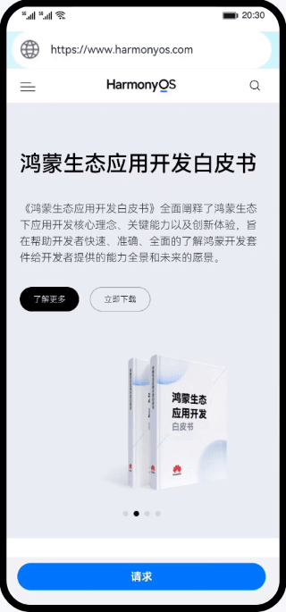

# HTTPS请求过程（ArkTS）

### 简介
基于网络模块，实现数据安全加密传输。

### 相关概念
- [Webview](https://developer.harmonyos.com/cn/docs/documentation/doc-references-V3/js-apis-webview-0000001427902720-V3)：提供Web控制能力，Web组件提供网页显示能力。
- [HTTP数据请求](https://developer.harmonyos.com/cn/docs/documentation/doc-references-V3/js-apis-http-0000001478061929-V3?catalogVersion=V3)：网络管理模块，提供HTTP数据请求能力，支持GET、POST、OPTIONS、HEAD、PUT、DELETE、TRACE、CONNECT请求方法。
- HTTPS：应用层协议，支持加密传输以及身份认证，保证数据的安全传输。
- SSL：SSL（Secure Socket Layer）安全套接层是位于传输通信协议（TCP/IP）之上实现的一种安全协议。
- TLS：TLS（Transport Layer Security）是一种安全协议，旨在实现数据加密传输。

### 相关权限
不涉及

### 使用说明

1. 如何使用@ohos.net.http进行https请求。

### 约束与限制
1. 本示例仅支持标准系统上运行，支持设备：华为手机或运行在DevEco Studio上的华为手机设备模拟器。
2. 本示例为Stage模型，支持API version 9。
3. 本示例需要使用DevEco Studio 3.1 Release版本进行编译运行。