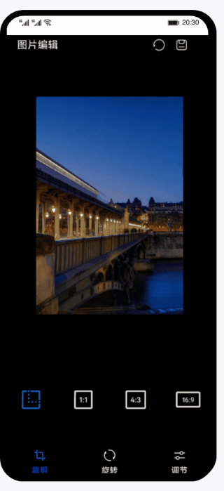

# 图片编辑（ArkTS）

### 简介

基于图片编解码，实现图片编辑，包含裁剪、旋转、色域调节（本章只介绍亮度、透明度、饱和度）等功能。

### 相关概念

- [图片解码](https://developer.harmonyos.com/cn/docs/documentation/doc-references-V3/js-apis-image-0000001477981401-V3#ZH-CN_TOPIC_0000001523648994__imagesource)：读取不同格式的图片文件，无压缩的解码为位图格式。
- [PixelMap](https://developer.harmonyos.com/cn/docs/documentation/doc-references-V3/js-apis-image-0000001477981401-V3#ZH-CN_TOPIC_0000001523648994__pixelmap7)：图片解码后的状态，用于对图片像素进行处理。
- [图片编码](https://developer.harmonyos.com/cn/docs/documentation/doc-references-V3/js-apis-image-0000001477981401-V3#ZH-CN_TOPIC_0000001523648994__imagepacker)：图片经过像素处理完成之后，需要重新进行编码打包，生成需要的图片格式。

### 相关权限

- ohos.permission.MEDIA_LOCATION
- ohos.permission.READ_MEDIA
- ohos.permission.WRITE_MEDIA

### 使用说明

1. 按照个人需求点击按钮进行裁剪及调节。
2. 完成之后可按需保存图片。

### 约束与限制

1. 本示例仅支持标准系统上运行，支持设备：华为手机或运行在DevEco Studio上的华为手机设备模拟器。
2. 本示例为Stage模型，支持API version 9。
3. 本示例需要使用DevEco Studio 3.1 Release版本进行编译运行。

