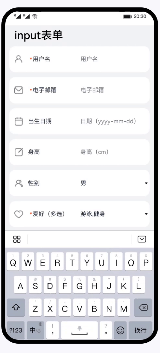

# input、label组件的使用（JS）

### 简介

基于input、label和dialog组件，实现表单页面的输入、必填校验和提交功能。

### 相关概念

- [input组件](https://developer.harmonyos.com/cn/docs/documentation/doc-references-V3/js-components-basic-input-0000001478341213-V3?catalogVersion=V3&ha_linker=eyJ0cyI6MTY4NTQxNDM3MDU5OCwiaWQiOiJhMDEwYWRjNDg3N2ZhMWYwMzc0ZTYzNTdlMjk3ZDkzZCJ9)：交互式组件，包括单选框，多选框，按钮和单行文本输入框。
- [label组件](https://developer.harmonyos.com/cn/docs/documentation/doc-references-V3/js-components-basic-label-0000001478061761-V3?catalogVersion=V3&ha_linker=eyJ0cyI6MTY4NTQxNDM4NTkwNSwiaWQiOiJhMDEwYWRjNDg3N2ZhMWYwMzc0ZTYzNTdlMjk3ZDkzZCJ9)：为input、button、textarea组件定义相应的标注，点击该标注时会触发绑定组件的点击效果。
- [dialog组件](https://developer.harmonyos.com/cn/docs/documentation/doc-references-V3/js-components-container-dialog-0000001477981249-V3?catalogVersion=V3&ha_linker=eyJ0cyI6MTY4NTQxNDQwMjY2MCwiaWQiOiJhMDEwYWRjNDg3N2ZhMWYwMzc0ZTYzNTdlMjk3ZDkzZCJ9)：自定义弹窗容器。

### 相关权限

不涉及

### 使用说明

1. 为input组件设置不同类型（如：text，email，date等），完成表单页面。
2. 对表单页面中的用户名、电子邮件、爱好输入框进行必填校验。
3. 使用弹框选择性别、爱好。

### 约束与限制

1. 本示例仅支持标准系统上运行，支持设备：华为手机或运行在DevEco Studio上的华为手机设备模拟器。
2. 本示例为FA模型，支持API version 9及以上版本SDK。
3. 本示例需要使用DevEco Studio 3.1 Release及以上版本进行编译运行。