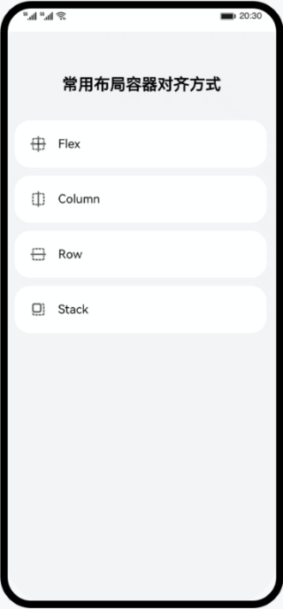

# ArkUI 常用布局容器对齐方式（ArkTS）

### 简介

本篇Codelab主要介绍Flex、Column、Row和Stack这四种布局容器内子组件对齐方式的设置方法。通过本Codelab您将学会在不同的容器内如何灵活的使用alignItems、justifyContent、alignContent、alignSelf和align这5种设置对齐方式。

### 相关概念

- **主轴**：在布局容器中，默认存在两根轴，分别是主轴和交叉轴，不同的容器中主轴的方向不一样的。
  - 在Column容器中主轴的方向是垂直方向。
  - 在Row容器中主轴的方向是水平方向。
  - 在Flex容器中可以通过direction参数设置主轴的方向，设置为Column时，主轴的方向是垂直方向。设置为Row时，主轴的方向是水平方向。
  - 在Stack容器中没有明确主轴与交叉轴，通过设置alignContent参数来改变容器内组件的对齐方式。
- **交叉轴**：与主轴垂直相交的轴线，如果主轴是垂直方向，则交叉轴就是水平方向；如果主轴是水平方向，则交叉轴是垂直方向。

### 相关权限

不涉及

### 使用说明

1. 在主界面有四个容器模块，分别时Flex，Column，Row和Stack，点击不同的容器模块，则会跳转到该容器对齐方式属性设置和子组件显示界面。
2. 在第二个界面有不同的属性单选框列表，选择不同的对齐方式，容器内子组件对齐方式回发生改变。

### 约束与限制

1. 本示例仅支持标准系统上运行，支持设备：华为手机或运行在DevEco Studio上的华为手机设备模拟器。
2. 本示例为Stage模型，支持API version 9及以上版本SDK。
3. 本示例需要使用DevEco Studio 3.1 Beta2及以上版本进行编译运行。