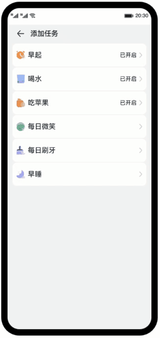

# List组件的使用之设置项（ArkTS）

### 简介
基于ArkTS，使用List组件以及路由能力，实现一个设置列表，点击对应的设置项可以跳转到详细的设置页。

### 相关概念
- [@CustomDialog](https://developer.harmonyos.com/cn/docs/documentation/doc-guides-V3/arkts-common-components-custom-dialog-0000001450754206-V3?catalogVersion=V3)：@CustomDialog装饰器用于装饰自定义弹窗。
- [List](https://developer.harmonyos.com/cn/docs/documentation/doc-references-V3/ts-container-list-0000001477981213-V3?catalogVersion=V3)：List是常用的滚动类容器组件之一，它按照水平或者竖直方向线性排列子组件， List的子组件必须是ListItem，它的宽度默认充满List的宽度。
- [TimePicker](https://developer.harmonyos.com/cn/docs/documentation/doc-references-V3/ts-basic-components-timepicker-0000001478341149-V3?catalogVersion=V3)：TimePicker是选择时间的滑动选择器组件，默认以 00:00 至 23:59 的时间区创建滑动选择器。
- [Toggle](https://developer.harmonyos.com/cn/docs/documentation/doc-references-V3/ts-basic-components-toggle-0000001478061705-V3?catalogVersion=V3)：组件提供勾选框样式、状态按钮样式及开关样式。
- [Router](https://developer.harmonyos.com/cn/docs/documentation/doc-references-V3/js-apis-router-0000001478061893-V3?catalogVersion=V3)：通过不同的url访问不同的页面，包括跳转到应用内的指定页面、用应用内的某个页面替换当前页面、返回上一页面或指定的页面等。

### 相关权限
不涉及

### 使用说明
1.  点击其中一项任务设置，进入对应的详细编辑页。
2.  打开对应的任务开关，然后进行详细的相关编辑。如：选择早起，目标设置为0830， 开启提醒，提醒时间为08:30，将频率设置为周六日。
3.  点击完成，弹出提示设置成功。

### 约束与限制
1. 本示例仅支持标准系统上运行，支持设备：华为手机或运行在DevEco Studio上的华为手机设备模拟器。
2. 本示例为Stage模型，支持API version 9。
3. 本示例需要使用DevEco Studio 3.1 Release版本进行编译运行。

