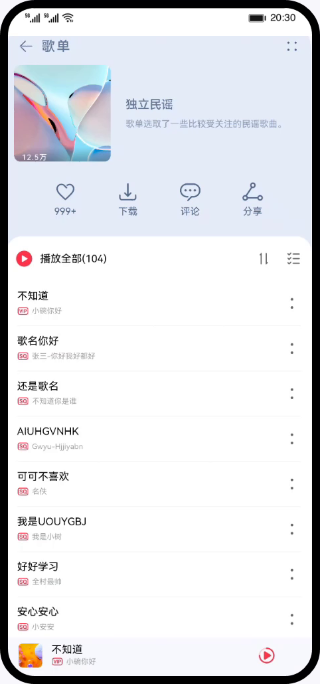
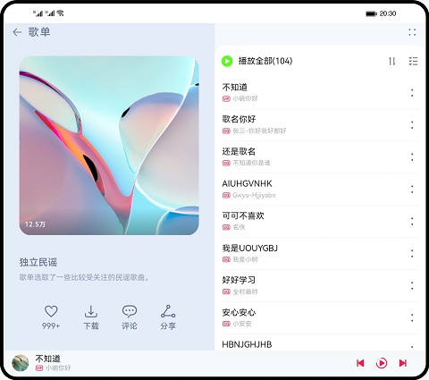
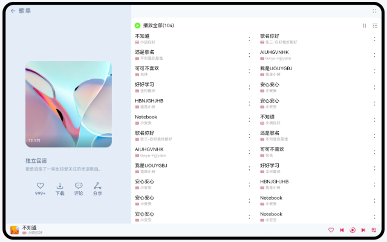

# 一次开发，多端部署-音乐专辑（ArkTS）

### 简介
基于自适应和响应式布局，实现一次开发、多端部署音乐专辑页面。手机效果图如下：

折叠屏效果图如下：

平板效果图如下：

### 相关概念
- [一次开发，多端部署](https://developer.harmonyos.com/cn/docs/documentation/doc-guides/harmonyos-features-0000000000011907#section35241557442)：一套代码工程，一次开发上架，多端按需部署。支撑开发者快速高效的开发支持多种终端设备形态的应用，实现对不同设备兼容的同时，提供跨设备的流转、迁移和协同的分布式体验。
- 自适应布局：当外部容器大小发生变化时，元素可以根据相对关系自动变化以适应外部容器变化的布局能力。相对关系如占比、固定宽高比、显示优先级等。当前自适应布局有4种：[线性布局](https://developer.harmonyos.com/cn/docs/documentation/doc-guides-V3/arkts-layout-development-linear-0000001504125349-V3?catalogVersion=V3)、[层叠布局](https://developer.harmonyos.com/cn/docs/documentation/doc-guides-V3/arkts-layout-development-stack-layout-0000001454605342-V3?catalogVersion=V3)、[弹性布局](https://developer.harmonyos.com/cn/docs/documentation/doc-guides-V3/arkts-layout-development-flex-layout-0000001504525013-V3?catalogVersion=V3)、[相对布局](https://developer.harmonyos.com/cn/docs/documentation/doc-guides-V3/arkts-layout-development-relative-layout-0000001455042516-V3?catalogVersion=V3)。自适应布局能力可以实现界面显示随外部容器大小连续变化。
- 响应式布局：当外部容器大小发生变化时，元素可以根据断点、栅格或特定的特征（如屏幕方向、窗口宽高等）自动变化以适应外部容器变化的布局能力。当前响应式布局能力有2种：[媒体查询](https://developer.harmonyos.com/cn/docs/documentation/doc-guides-V3/arkts-layout-development-media-query-0000001454445606-V3?catalogVersion=V3)、[栅格布局](https://developer.harmonyos.com/cn/docs/documentation/doc-guides-V3/arkts-layout-development-grid-layout-0000001454765270-V3?catalogVersion=V3)。
- [GridRow](https://developer.harmonyos.com/cn/docs/documentation/doc-references-V3/ts-container-gridrow-0000001478181425-V3)：栅格容器组件，仅可以和栅格子组件（GridCol）在栅格布局场景中使用。
- [GridCol](https://developer.harmonyos.com/cn/docs/documentation/doc-references-V3/ts-container-gridcol-0000001427744832-V3)：栅格子组件，必须作为栅格容器组件（GridRow）的子组件使用。

### 相关权限

本篇Codelab需要添加以下权限：

- ohos.permission.KEEP_BACKGROUND_RUNNING

### 使用说明

1. 分别在手机、折叠屏、平板安装并打开应用，不同设备的应用页面通过响应式布局和自适应布局呈现不同的效果。
2. 点击界面上播放/暂停、上一首、下一首图标控制音乐播放功能。
3. 点击界面上播放控制区空白处或列表歌曲跳转到播放页面。
4. 点击界面上评论按钮跳转到对应的评论页面。
5. 其他按钮无实际点击事件或功能。

### 约束与限制

1. 本示例仅支持标准系统上运行，支持设备：华为手机或运行在DevEco Studio上的华为手机设备模拟器。
2. 本示例为Stage模型，支持API version 9。
3. 本示例需要使用DevEco Studio 3.1 Release版本进行编译运行。