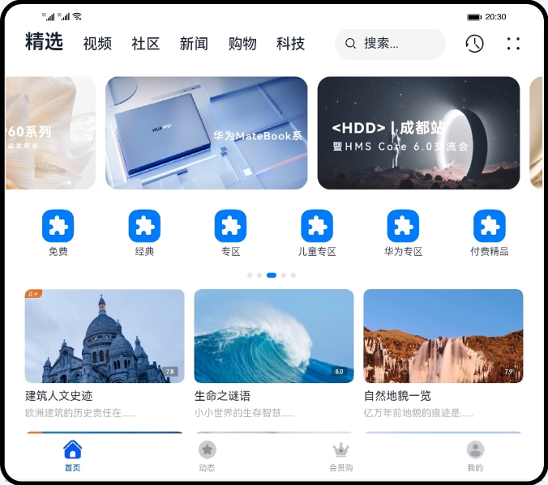
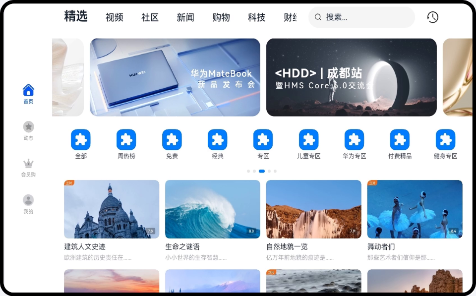
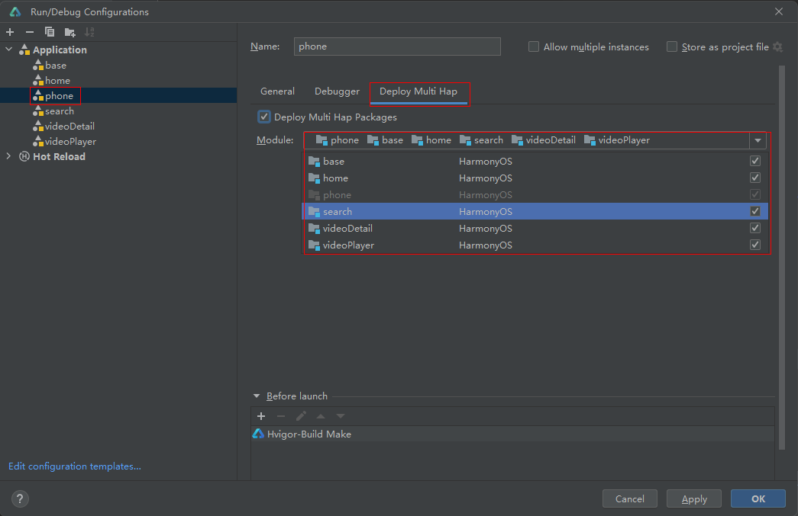

# 一多开发实例-视频

### 介绍

本篇Codelab基于自适应布局和响应式布局，实现一次开发，多端部署的长视频页面。通过“三层工程架构”实现代码复用，并根据手机、折叠屏以及2in1不同的设备尺寸设计对应页面。

手机效果如图所示：

折叠屏展开态效果如图所示：

2in1效果如图所示：

### 相关概念

- [一次开发，多端部署](https://developer.harmonyos.com/cn/docs/documentation/doc-guides/harmonyos-features-0000000000011907#section35241557442)：一套代码工程，一次开发上架，多端按需部署。支撑开发者快速高效的开发支持多种终端设备形态的应用，实现对不同设备兼容的同时，提供跨设备的流转、迁移和协同的分布式体验。
- 自适应布局：当外部容器大小发生变化时，元素可以根据相对关系自动变化以适应外部容器变化的布局能力。相对关系如占比、固定宽高比、显示优先级等。当前自适应布局有4种：[线性布局](https://developer.harmonyos.com/cn/docs/documentation/doc-guides-V3/arkts-layout-development-linear-0000001504125349-V3?catalogVersion=V3)、[层叠布局](https://developer.harmonyos.com/cn/docs/documentation/doc-guides-V3/arkts-layout-development-stack-layout-0000001454605342-V3?catalogVersion=V3)、[弹性布局](https://developer.harmonyos.com/cn/docs/documentation/doc-guides-V3/arkts-layout-development-flex-layout-0000001504525013-V3?catalogVersion=V3)、[相对布局](https://developer.harmonyos.com/cn/docs/documentation/doc-guides-V3/arkts-layout-development-relative-layout-0000001455042516-V3?catalogVersion=V3)。自适应布局能力可以实现界面显示随外部容器大小连续变化。
- 响应式布局：当外部容器大小发生变化时，元素可以根据断点、栅格或特定的特征（如屏幕方向、窗口宽高等）自动变化以适应外部容器变化的布局能力。当前响应式布局能力有2种：[媒体查询](https://developer.harmonyos.com/cn/docs/documentation/doc-guides-V3/arkts-layout-development-media-query-0000001454445606-V3?catalogVersion=V3)、[栅格布局](https://developer.harmonyos.com/cn/docs/documentation/doc-guides-V3/arkts-layout-development-grid-layout-0000001454765270-V3?catalogVersion=V3)。
- [GridRow](https://developer.harmonyos.com/cn/docs/documentation/doc-references-V3/ts-container-gridrow-0000001478181425-V3)：栅格容器组件，仅可以和栅格子组件（GridCol）在栅格布局场景中使用。
- [GridCol](https://developer.harmonyos.com/cn/docs/documentation/doc-references-V3/ts-container-gridcol-0000001427744832-V3)：栅格子组件，必须作为栅格容器组件（GridRow）的子组件使用。

### 使用说明

1. 进入应用，用户可查看首页内容，支持上下滑动，Banner左右滑动，图标列表左右滑动。
2. 用户长按“建筑人文史迹”对应图片，能够预览视频。
3. 在2in1和折叠屏设备上，两指捏合推荐视频区能够缩放或放大。
4. 在2in1设备上，切换视频tab，查看Banner图的创新排版，切换社区tab，查看首页的沉浸式设计。
5. 点击顶部搜索框，输入“华”，出现智能提示页面。
6. 点击智能提示中的“华为发布会”，出现搜索结果页面。
7. 点击搜索结果中的播放按钮，进入搜索详情页，用户可以观看视频，点击视频进行播放/暂停，点击/拖动进度条能够跳转播放。
8. 相关列表支持左右滑动，选集和周边视频支持左右滑动。
9. 在手机/折叠屏上，上滑时，相关列表先隐藏，视频再等比缩小，然后滑动评论区。
10. 在2in1设备上，上滑时，视频等比缩小，然后滑动视频简介区。侧边栏支持宽度增加/减小，评论区支持上下滑动。
11. 点击全屏按钮，进入全屏播放页，用户可以全屏观看视频，点击播放/暂停按钮，控制视频播放/暂停。
12. 点击选集按钮，显示选集工具栏。

### 注意
运行时需设置引用所有HSP模块。点击Run > Edit Configurations，选择Deploy Multi Hap标签页，勾选Deploy Multi Hap Packages， 选择使用方模块（phone）和所有HSP模块，点击OK。单击Run > Run “模块名称”（如Run ”entry“）或来启动应用/服务的编译构建。

### 约束与限制

1. 本示例仅支持标准系统上运行，设备类型：华为手机。
2. 本示例为Stage模型，支持API version 10及以上版本SDK。
3. 本示例需要使用DevEco Studio 4.0 Beta1及以上版本进行编译运行。