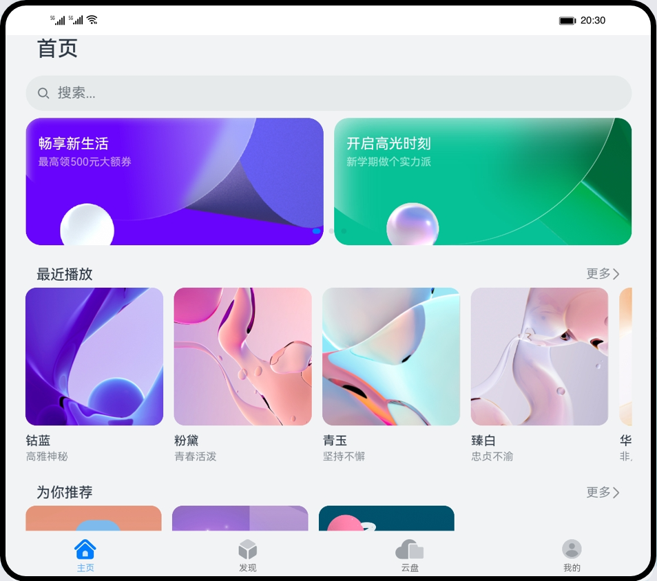
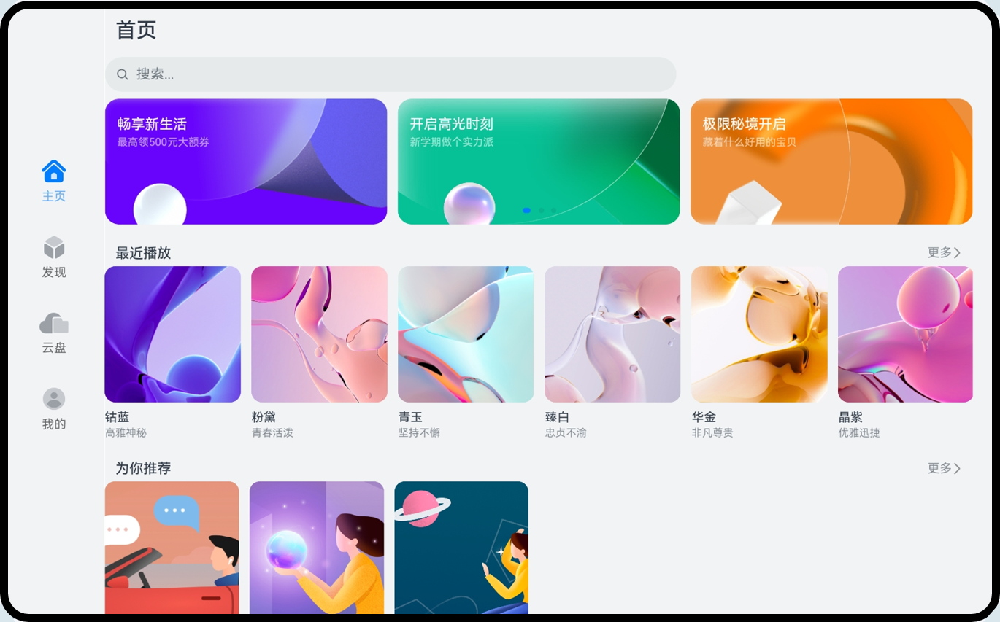

# 一次开发，多端部署-视频应用（ArkTS）

### 简介
基于“一次开发，多端部署”能力实现的一个视频播放类应用主页面。

手机效果图如下：

折叠屏效果图如下：

平板效果图如下：

### 相关概念
-   [一次开发，多端部署](https://developer.harmonyos.com/cn/docs/documentation/doc-guides/harmonyos-features-0000000000011907#section35241557442)：指一套代码工程，一次开发上架，多端按需部署，目标是支撑开发者高效地开发支持多种终端设备形态的应用。
-   [自适应布局](https://developer.harmonyos.com/cn/docs/documentation/doc-guides/ui-ts-layout-linear-0000001436217305)：当外部容器大小发生变化时，元素可以根据相对关系自动变化以适应外部容器变化的布局能力。相对关系如占比、固定宽高比、显示优先级等。当前自适应布局能力有7种：拉伸能力、均分能力、占比能力、缩放能力、延伸能力、隐藏能力、折行能力。自适应布局能力可以实现界面显示随外部容器大小连续变化。
-   [响应式布局](https://developer.harmonyos.com/cn/docs/documentation/doc-guides/ui-ts-layout-grid-container-0000001385338468)：当外部容器大小发生变化时，元素可以根据断点、栅格或特定的特征（如屏幕方向、窗口宽高等）自动变化以适应外部容器变化的布局能力。当前响应式布局能力有3种：断点、媒体查询、栅格布局。
-   [GridRow](https://developer.harmonyos.com/cn/docs/documentation/doc-references-V3/ts-container-gridrow-0000001478181425-V3)：栅格容器组件，仅可以和栅格子组件（GridCol）在栅格布局场景中使用。
-   [GridCol](https://developer.harmonyos.com/cn/docs/documentation/doc-references-V3/ts-container-gridcol-0000001427744832-V3)：栅格子组件，必须作为栅格容器组件（GridRow）的子组件使用。

### 相关权限
不涉及

### 使用说明

1. 在手机、折叠屏和平板上安装应用，打开会显示不同形态的用户界面。

### 约束与限制
1. 本示例仅支持标准系统上运行，支持设备：华为手机或运行在DevEco Studio上的华为手机设备模拟器。
2. 本示例为Stage模型，支持API version 9及以上版本SDK。
3. 本示例需要使用DevEco Studio 3.1 Beta2及以上版本进行编译运行。

