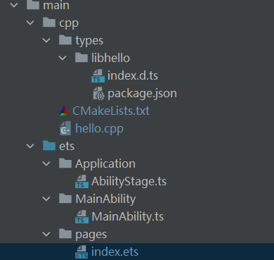
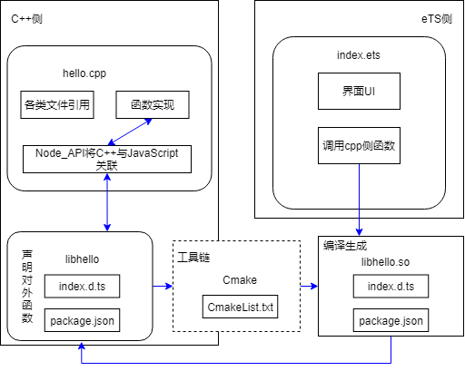
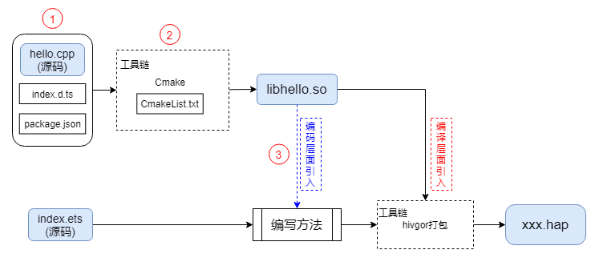

# 1.介绍

本篇Codelab主要介绍如何使用DevEco Studio创建一个Native C++应用。应用采用“Native C++”模板，实现了通过Node-API调用C标准库的功能。本示例通过调用C标准库接口来演示调用过程，具体接口是C标准库的计算两个给定数平方和的平方根（hypot）。Codelab实现效果如下图所示：


# 2.相关概念

Node_API：用于封装JavaScript能力为native插件的API，独立于底层JavaScript，并作为Node.js的一部分。

Native API中支持的标准库：目前支持标准C库、C++库、OpenSL ES、zlib。

[C常用函数库](https://zh.cppreference.com/w/c/numeric/math)：math.h。

[Cmake](https://cmake.org/cmake/help/latest/)：管理源代码构建的工具。

# 3.搭建HarmonyOS环境

我们首先需要完成HarmonyOS开发环境搭建，可参照如下步骤进行。

-   安装DevEco Studio，详情请参见[下载和安装软件](https://developer.harmonyos.com/cn/docs/documentation/doc-guides/software_install-0000001053582415)。
-   设置DevEco Studio开发环境，DevEco Studio开发环境需要依赖于网络环境，需要连接上网络才能确保工具的正常使用，可以根据如下两种情况来配置开发环境：
    1.  如果可以直接访问Internet，只需进行[下载HarmonyOS SDK](https://developer.harmonyos.com/cn/docs/documentation/doc-guides/environment_config-0000001052902427)操作。
    2.  如果网络不能直接访问Internet，需要通过代理服务器才可以访问，请参见[配置开发环境](https://developer.harmonyos.com/cn/docs/documentation/doc-guides/environment_config-0000001052902427)。

-   开发者可以参见以下链接，完成设备调试的相关配置：

    [使用真机进行调试](https://developer.harmonyos.com/cn/docs/documentation/doc-guides/ide_debug_device-0000001053822404)

# 4.代码结构解读

本篇Codelab只对核心代码进行讲解，整个工程的代码结构如下：



文件说明如下：

```
├── cpp：C++代码区									
│   ├── types：                                          // 接口存放文件夹
│   │   └── libhello							
│   │       ├── index.d.ts                              // 接口文件
│   │       └── package.json                            // 接口注册配置文件
│   ├── CmakeList.text                                  // Cmake打包配置文件
│   └── hello.cpp                                       // C++源代码
└── ets                                                 // ets代码区
    └── Application
    │   └── AbilityStage.ts                             // Hap包运行时类
    ├── MainAbility
    │   └── MainAbility.ts                              // Ability，提供对Ability生命周期、上下文环境等调用管理
    └── pages
        └── index.ets                                   // 主页面
```

# 5.eTS调用C++方法流程

1.  应用架构。

    整个应用架构可以分为三部分：C++侧、eTS侧、工具链。

    -   C++侧：包含各种文件的引用、C++或者C代码、Node\_API将C++函数与JavaScript关联的信息等。
    -   eTS侧：包含界面UI、自身方法，调用引用包的方法等。
    -   工具链：包含Cmake打包工具在内的系列工具。

    在eTS调用C++方法的过程中，需要使用到Node\_API、Cmake等工具来做中间转换，整个架构及其关联关系如下：

    

    > **说明：** 
    >在上面的示意图中，hello.cpp文件用来编写C++代码，并通过Node\_API将C++函数与JavaScript方法关联。C++代码通过Cmake打包工具打包成动态链接库SO文件,并通过xxx.d.ts文件对外提供接口。eTS端通过引入SO包的方式去调用SO文件中的接口。

2.  调用、打包流程。

    在eTS调用C++方法的过程中，调用、打包流程如下：

    

    > **说明：** 
    >上图中C++代码通过Cmake打包成SO文件后可以直接被eTS侧引入，最终通过hivgor一起打包成可执行的HarmonyOS hap包。

    重点环节说明如下：

    -   ①cpp源码编写，Node\_API将C++函数与JavaScript方法关联，index.d.ts接口文档，package.json文件编写。

        （1）c++编写“hyPotC”方法，用以实现计算两个数平方和的平方根。

        ```
        #include "napi/native_api.h"
        #include "math.h"
        static napi_value hyPotC(napi_env env, napi_callback_info info){
            ...
        }
        ```

        （2）Node\_API将C++函数与JavaScript方法关联。

        将C++的“hyPotC”函数进行注册，注册的对外接口名为“hyPot”。

        ```
        static napi_value Init(napi_env env, napi_value exports){
            napi_property_descriptor desc[] = {
                { "hyPot", nullptr, hyPotC, nullptr, nullptr, nullptr, napi_default, nullptr },
            };
           ...
        }
        ```

        （3）index.d.ts接口文档编写。

        ```
        export const hyPot: (a: number, b: number) => number;
        ```

        （4）package.json文件编写。

        ```
        {
          "name": "libhello.so",
          "types": "./index.d.ts"
        }
        ```

    -   ②Cmake打包配置、CmakeList.txt配置需要添加的hello.cpp文件。

        ```
        add_library(hello SHARED hello.cpp)
        ```

    -   ③index.ets中引入SO包，调用SO包中的hyPot方法。

        ```
        import libHello from "libhello.so"
        ...
          Button(this.buttonSubmit)
          ...
          .onClick(() => {
            this.result = libHello.hyPot(this.num1,this.num2)
          })
        ```

# 6.C++方法实现

1.  编写方法。
    1.  方法说明：

        <table><thead align="left"><tr id="row17738055184318"><th class="cellrowborder" valign="top" width="50%" id="mcps1.1.3.1.1"><p id="p4738195510438"><a name="p4738195510438"></a><a name="p4738195510438"></a>方法名</p>
        </th>
        <th class="cellrowborder" valign="top" width="50%" id="mcps1.1.3.1.2"><p id="p8739195524318"><a name="p8739195524318"></a><a name="p8739195524318"></a>说明</p>
        </th>
        </tr>
        </thead>
        <tbody><tr id="row8739195510431"><td class="cellrowborder" valign="top" width="50%" headers="mcps1.1.3.1.1 "><p id="p127397559439"><a name="p127397559439"></a><a name="p127397559439"></a>hyPotC</p>
        </td>
        <td class="cellrowborder" valign="top" width="50%" headers="mcps1.1.3.1.2 "><p id="p1973985524312"><a name="p1973985524312"></a><a name="p1973985524312"></a>求两个数平方和的平方根</p>
        </td>
        </tr>
        </tbody>
        </table>
        
    2.  hyPotC方法传入参数说明：
    
        <table><thead align="left"><tr id="row11475143610243"><th class="cellrowborder" valign="top" width="20.380000000000003%" id="mcps1.1.4.1.1"><p id="p4475173662414"><a name="p4475173662414"></a><a name="p4475173662414"></a>参数名</p>
        </th>
        <th class="cellrowborder" valign="top" width="33.379999999999995%" id="mcps1.1.4.1.2"><p id="p171541235112515"><a name="p171541235112515"></a><a name="p171541235112515"></a>类型</p>
        </th>
        <th class="cellrowborder" valign="top" width="46.239999999999995%" id="mcps1.1.4.1.3"><p id="p11476436152418"><a name="p11476436152418"></a><a name="p11476436152418"></a>说明</p>
        </th>
        </tr>
        </thead>
        <tbody><tr id="row8476153612411"><td class="cellrowborder" valign="top" width="20.380000000000003%" headers="mcps1.1.4.1.1 "><p id="p24761236172413"><a name="p24761236172413"></a><a name="p24761236172413"></a>env</p>
        </td>
        <td class="cellrowborder" valign="top" width="33.379999999999995%" headers="mcps1.1.4.1.2 "><p id="p6154173562520"><a name="p6154173562520"></a><a name="p6154173562520"></a>napi_env</p>
        </td>
        <td class="cellrowborder" valign="top" width="46.239999999999995%" headers="mcps1.1.4.1.3 "><p id="p14761336192415"><a name="p14761336192415"></a><a name="p14761336192415"></a>用于表示底层 Node-API 实现可以用来保持 VM 特定状态的上下文。</p>
        </td>
        </tr>
        <tr id="row18476113616243"><td class="cellrowborder" valign="top" width="20.380000000000003%" headers="mcps1.1.4.1.1 "><p id="p1347610366247"><a name="p1347610366247"></a><a name="p1347610366247"></a>info</p>
        </td>
        <td class="cellrowborder" valign="top" width="33.379999999999995%" headers="mcps1.1.4.1.2 "><p id="p4154535202513"><a name="p4154535202513"></a><a name="p4154535202513"></a>napi_callback_info</p>
        </td>
        <td class="cellrowborder" valign="top" width="46.239999999999995%" headers="mcps1.1.4.1.3 "><p id="p13476203602413"><a name="p13476203602413"></a><a name="p13476203602413"></a>传递给回调函数的不透明数据类型。它可用于获取有关调用回调的上下文的附加信息。</p>
        </td>
        </tr>
        </tbody>
        </table>
        
    3.  hyPotC返回参数说明：

        <table><thead align="left"><tr id="row9289741123910"><th class="cellrowborder" valign="top" width="30.709999999999997%" id="mcps1.1.3.1.1"><p id="p728974120394"><a name="p728974120394"></a><a name="p728974120394"></a>类型</p>
        </th>
        <th class="cellrowborder" valign="top" width="69.28999999999999%" id="mcps1.1.3.1.2"><p id="p142896410397"><a name="p142896410397"></a><a name="p142896410397"></a>说明</p>
        </th>
        </tr>
        </thead>
        <tbody><tr id="row52891741123916"><td class="cellrowborder" valign="top" width="30.709999999999997%" headers="mcps1.1.3.1.1 "><p id="p172891541113911"><a name="p172891541113911"></a><a name="p172891541113911"></a>napi_value</p>
        </td>
        <td class="cellrowborder" valign="top" width="69.28999999999999%" headers="mcps1.1.3.1.2 "><p id="p828944115392"><a name="p828944115392"></a><a name="p828944115392"></a>这是一个不透明的指针，用于表示 JavaScript 值（这里返回的是计算后的结果）。</p>
        </td>
        </tr>
        </tbody>
        </table>
        
    4.  编写方法。
    
        ```
        #include "napi/native_api.h"
        #include "math.h"
        static napi_value hyPotC(napi_env env, napi_callback_info info)
        {
            // 参数数量
            size_t argc = 2;
            // 声明参数数组
            napi_value args[2] = {nullptr};
            // 获取传入的参数并依次放入参数数组中
            napi_get_cb_info(env, info, &argc, args , nullptr, nullptr);
            // 对第一个js参数类型进行判定
            napi_valuetype valueType0;
            napi_typeof(env, args[0], &valueType0);
            // 对第二个js参数类型进行判定
            napi_valuetype valueType1;
            napi_typeof(env, args[1], &valueType1);
            // 将第一个传入参数转化为double类型
            double value0;
            napi_get_value_double(env, args[0], &value0);
            // 将第二个传入参数转化为double类型
            double value1;
            napi_get_value_double(env, args[1], &value1);
            // 声明返回结果字段，并调用C标准库的hypot方法进行计算
            napi_value sum;
            double result = hypot(value0,value1);
            napi_create_double(env, result, &sum);
            return sum;
        }
        ```
    
    5.  注册模块。
    
        模块注册是固定写法，在napi\_property\_descriptor desc\[\]中我们需要将编写的“hyPotC”方法（从左至右第三个参数）与对暴露的接口“hyPot”接口（从左至右第一个参数）进行关联，其他参考示例默认填写即可。
    
        示例：
    
        ```
         { "hyPot", nullptr, hyPotC, nullptr, nullptr, nullptr, napi_default, nullptr }
        ```
    
        模块注册代码：
    
        ```
        EXTERN_C_START
        static napi_value Init(napi_env env, napi_value exports)
        {
            napi_property_descriptor desc[] = {
                { "hypot", nullptr, Hypot, nullptr, nullptr, nullptr, napi_default, nullptr },
            };
            napi_define_properties(env, exports, sizeof(desc) / sizeof(desc[0]), desc);
            return exports;
        }
        EXTERN_C_END
        ```
    
    6.  其他模块描述。
    
        描述信息可以直接参考如下示例，nm\_modname可以根据实际情况修改。
    
        ```
        static napi_module demoModule = {
        .nm_version =1,
        .nm_flags = 0,
        .nm_filename = nullptr,
        .nm_register_func = Init,
        .nm_modname = "libhello",
        .nm_priv = ((void*)0),
        .reserved = { 0 },
        };
        extern "C" __attribute__((constructor)) void RegisterModule(void)
        {
        napi_module_register(&demoModule);
        }
        ```
    
2.  编写接口文档。

    index.d.ts用于对外提供方法、说明文档（名字可以更改，点击方法可以直接链接到index.d.ts）。

    ```
    export const hyPot: (a: number, b: number) => number;
    ```

3.  在package.json文件中将index.d.ts与cpp文件关联起来。

    ```
    {
      "name": "libhello.so",
      "types": "./index.d.ts"
    }
    ```

4.  CMakeLists.txt配置CMake打包参数。

    CMakeLists.txt是CMake打包的配置文件，里面的大部分内容无需修改，project、add\_library方法中的内容可以根据实际情况修改。

    ```
    # the minimum version of CMake.指明了对cmake的最低(高)版本的要求
    cmake_minimum_required(VERSION 3.4.1)
    #配置项目信息
    project(XComponent)
    #指定编程语言
    set(NATIVERENDER_ROOT_PATH ${CMAKE_CURRENT_SOURCE_DIR})
    #设置头文件的搜索目录
    include_directories(${NATIVERENDER_ROOT_PATH}
                        ${NATIVERENDER_ROOT_PATH}/include
                        )
    # 添加名为xxx的库
    add_library(hello SHARED hello.cpp)
    #构建此可执行文件需要链接的库
    target_link_libraries(hello PUBLIC libace_napi.z.so libc++.a)
    ```

# 7.界面设计

1.  界面整体规划效果如下图所示：

    

2.  设置所需要用到的参数。
    1.  参数说明。

        <table><thead align="left"><tr id="row1499316541047"><th class="cellrowborder" valign="top" width="20.25%" id="mcps1.1.4.1.1"><p id="p10994954446"><a name="p10994954446"></a><a name="p10994954446"></a>字段</p>
        </th>
        <th class="cellrowborder" valign="top" width="19.66%" id="mcps1.1.4.1.2"><p id="p10867844104016"><a name="p10867844104016"></a><a name="p10867844104016"></a>类型</p>
        </th>
        <th class="cellrowborder" valign="top" width="60.089999999999996%" id="mcps1.1.4.1.3"><p id="p5994175419417"><a name="p5994175419417"></a><a name="p5994175419417"></a>说明</p>
        </th>
        </tr>
        </thead>
        <tbody><tr id="row19941541042"><td class="cellrowborder" valign="top" width="20.25%" headers="mcps1.1.4.1.1 "><p id="p199942541241"><a name="p199942541241"></a><a name="p199942541241"></a>tittle</p>
        </td>
        <td class="cellrowborder" valign="top" width="19.66%" headers="mcps1.1.4.1.2 "><p id="p108689443406"><a name="p108689443406"></a><a name="p108689443406"></a>string</p>
        </td>
        <td class="cellrowborder" valign="top" width="60.089999999999996%" headers="mcps1.1.4.1.3 "><p id="p1599415541948"><a name="p1599415541948"></a><a name="p1599415541948"></a>应用标题</p>
        </td>
        </tr>
        <tr id="row1899465413419"><td class="cellrowborder" valign="top" width="20.25%" headers="mcps1.1.4.1.1 "><p id="p19994254344"><a name="p19994254344"></a><a name="p19994254344"></a>message</p>
        </td>
        <td class="cellrowborder" valign="top" width="19.66%" headers="mcps1.1.4.1.2 "><p id="p128683441405"><a name="p128683441405"></a><a name="p128683441405"></a>string</p>
        </td>
        <td class="cellrowborder" valign="top" width="60.089999999999996%" headers="mcps1.1.4.1.3 "><p id="p16994854243"><a name="p16994854243"></a><a name="p16994854243"></a>示例说明</p>
        </td>
        </tr>
        <tr id="row499420542411"><td class="cellrowborder" valign="top" width="20.25%" headers="mcps1.1.4.1.1 "><p id="p11994125420411"><a name="p11994125420411"></a><a name="p11994125420411"></a>tipsNum1</p>
        </td>
        <td class="cellrowborder" valign="top" width="19.66%" headers="mcps1.1.4.1.2 "><p id="p286814494019"><a name="p286814494019"></a><a name="p286814494019"></a>number</p>
        </td>
        <td class="cellrowborder" valign="top" width="60.089999999999996%" headers="mcps1.1.4.1.3 "><p id="p49951354241"><a name="p49951354241"></a><a name="p49951354241"></a>提示输入第一个参数</p>
        </td>
        </tr>
        <tr id="row7995145419414"><td class="cellrowborder" valign="top" width="20.25%" headers="mcps1.1.4.1.1 "><p id="p1199617541147"><a name="p1199617541147"></a><a name="p1199617541147"></a>tipsNum2</p>
        </td>
        <td class="cellrowborder" valign="top" width="19.66%" headers="mcps1.1.4.1.2 "><p id="p5868204414011"><a name="p5868204414011"></a><a name="p5868204414011"></a>number</p>
        </td>
        <td class="cellrowborder" valign="top" width="60.089999999999996%" headers="mcps1.1.4.1.3 "><p id="p4133195524315"><a name="p4133195524315"></a><a name="p4133195524315"></a>提示输入第二个参数</p>
        </td>
        </tr>
        <tr id="row1899625420417"><td class="cellrowborder" valign="top" width="20.25%" headers="mcps1.1.4.1.1 "><p id="p18996954643"><a name="p18996954643"></a><a name="p18996954643"></a>tipsResult</p>
        </td>
        <td class="cellrowborder" valign="top" width="19.66%" headers="mcps1.1.4.1.2 "><p id="p1286844484014"><a name="p1286844484014"></a><a name="p1286844484014"></a>string</p>
        </td>
        <td class="cellrowborder" valign="top" width="60.089999999999996%" headers="mcps1.1.4.1.3 "><p id="p1499615416415"><a name="p1499615416415"></a><a name="p1499615416415"></a>结果提示</p>
        </td>
        </tr>
        <tr id="row109963541648"><td class="cellrowborder" valign="top" width="20.25%" headers="mcps1.1.4.1.1 "><p id="p49962054342"><a name="p49962054342"></a><a name="p49962054342"></a>buttonSubmit</p>
        </td>
        <td class="cellrowborder" valign="top" width="19.66%" headers="mcps1.1.4.1.2 "><p id="p1686817444408"><a name="p1686817444408"></a><a name="p1686817444408"></a>string</p>
        </td>
        <td class="cellrowborder" valign="top" width="60.089999999999996%" headers="mcps1.1.4.1.3 "><p id="p09962549413"><a name="p09962549413"></a><a name="p09962549413"></a>计算按钮名称</p>
        </td>
        </tr>
        <tr id="row159961547416"><td class="cellrowborder" valign="top" width="20.25%" headers="mcps1.1.4.1.1 "><p id="p69978541349"><a name="p69978541349"></a><a name="p69978541349"></a>result</p>
        </td>
        <td class="cellrowborder" valign="top" width="19.66%" headers="mcps1.1.4.1.2 "><p id="p1586974417407"><a name="p1586974417407"></a><a name="p1586974417407"></a>string</p>
        </td>
        <td class="cellrowborder" valign="top" width="60.089999999999996%" headers="mcps1.1.4.1.3 "><p id="p15997454845"><a name="p15997454845"></a><a name="p15997454845"></a>结果</p>
        </td>
        </tr>
        <tr id="row899718547413"><td class="cellrowborder" valign="top" width="20.25%" headers="mcps1.1.4.1.1 "><p id="p1899720541844"><a name="p1899720541844"></a><a name="p1899720541844"></a>num1</p>
        </td>
        <td class="cellrowborder" valign="top" width="19.66%" headers="mcps1.1.4.1.2 "><p id="p128691644184016"><a name="p128691644184016"></a><a name="p128691644184016"></a>number</p>
        </td>
        <td class="cellrowborder" valign="top" width="60.089999999999996%" headers="mcps1.1.4.1.3 "><p id="p499718543419"><a name="p499718543419"></a><a name="p499718543419"></a>输入的第一数</p>
        </td>
        </tr>
        <tr id="row159973542412"><td class="cellrowborder" valign="top" width="20.25%" headers="mcps1.1.4.1.1 "><p id="p1299720541041"><a name="p1299720541041"></a><a name="p1299720541041"></a>num2</p>
        </td>
        <td class="cellrowborder" valign="top" width="19.66%" headers="mcps1.1.4.1.2 "><p id="p5869144174020"><a name="p5869144174020"></a><a name="p5869144174020"></a>number</p>
        </td>
        <td class="cellrowborder" valign="top" width="60.089999999999996%" headers="mcps1.1.4.1.3 "><p id="p299711543419"><a name="p299711543419"></a><a name="p299711543419"></a>输入的第二个数</p>
        </td>
        </tr>
        </tbody>
        </table>
        
    2.  代码中设置参数，详情请参考源码。
    
        ```
        @Entry
        @Component
        struct Index {
          private textInputController1: TextInputController = new TextInputController()
          private textInputController2: TextInputController = new TextInputController()
          private tittle: string = '调用C标准库示例'
          ...
          build() {
           ...
          }
        }
        ```
    
3.  界面实现，详情请参考源码。

    ```
    @Entry
    @Component
    struct Index {
      ...
      build() {
        Column() {
          Row(){
            ...
          }.height(150).width('100%').justifyContent(FlexAlign.Center)
          Row(){
            ...
          }.height(60).width('100%').justifyContent(FlexAlign.Center)
          Row(){
            ...
          }.height(50).width('100%').justifyContent(FlexAlign.Start)
          Row(){
            ...
          }.height(50).width('100%').margin({top:20})
          Row(){
           ...
          }.height(60).width('100%').touchable(false)
          Row(){
           ...
          }.height(80).width('100%').justifyContent(FlexAlign.Center)
        }
        .width('100%')
        .height(500)
      }
    }
    ```

4.  绑定事件、关联参数。

    在这一步中，两个TextInput组件分别绑定onChange事件，并分别关联num1，num2来记录输入的参数

    ```
    @Entry
    @Component
    struct Index {
      ...
      build() {
          Column() {
            ...
            Row(){
              ...
              TextInput({ placeholder: '请输入第一个数字：', controller:this.textInputController1}).type(InputType.Number)
                .height('100%').width('60%').margin({left:10,right:30})
                .onChange(value =>{this.num1 = parseFloat(value)})
            }.height(50).width('100%').justifyContent(FlexAlign.Start)
            Row(){
              ...
              TextInput({ placeholder: '请输入第二个数字：', controller:this.textInputController2}).type(InputType.Number)
                .height('100%').width('60%').margin({left:10,right:30})
                .onChange(value =>{this.num2 = parseFloat(value)})
            }.height(50).width('100%').margin({top:20})
           ...
        .height('100%')
      }
    }
    ```

# 8.JS调用C++方法

1.  在index.ets文件中引入编译好的SO包。

    ```
    import libHello from "libhello.so"
    ```

2.  Button组件添加点击事件，调用testNapi中的方法。

    ```
     Button(this.buttonSubmit)
      .fontSize(40)
      .fontWeight(FontWeight.Bold)
      .margin({top:5})
      .height(100)
      .width(200)
      .onClick(() => {
        this.result = libHello.hyPot(this.num1,this.num2)
    })
    ```

3. hvihgor打包将so文件与eTS代码一起打包成hap包。

4. 安装hap包运行。

# 9.恭喜您

通过本篇Codelab我们了解了C++代码如何与JS实现关联，eTS如何调用SO包中的接口等，同时也掌握了C++代码的具体编写与打包流程。

知识点：

-   Node\_API
-   Native API中支持的标准库
-   C常用函数库
-   Cmake

# 10.完整示例

gitee

github
