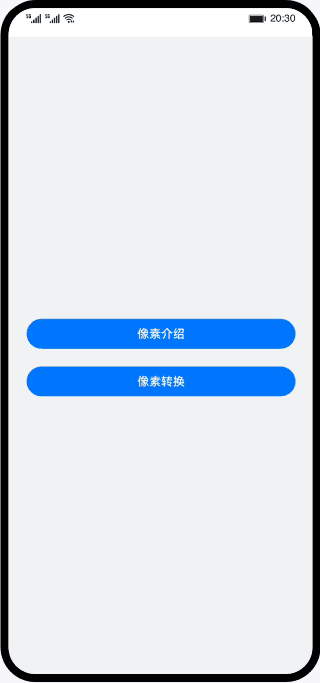

# 像素转换（ArkTS）

### 简介
基于像素单位，展示了像素单位的基本知识与像素转换API的使用。

### 相关概念
- [像素单位](https://developer.harmonyos.com/cn/docs/documentation/doc-references-V3/ts-pixel-units-0000001478341189-V3)：为开发者提供4种像素单位，框架采用vp为基准数据单位。
- [List](https://developer.harmonyos.com/cn/docs/documentation/doc-references-V3/ts-container-list-0000001477981213-V3)：列表包含一系列相同宽度的列表项。适合连续、多行呈现同类数据，例如图片和文本。
- [Column](https://developer.harmonyos.com/cn/docs/documentation/doc-references-V3/ts-container-column-0000001478341157-V3)：沿垂直方向布局的容器。
- [Text](https://developer.harmonyos.com/cn/docs/documentation/doc-references-V3/ts-basic-components-text-0000001477981201-V3)：显示一段文本的组件。

### 相关权限
不涉及

### 使用说明

1. 用户可以查看像素单位的概念和详细信息。
2. 用户可以查看像素转换API的使用方法。

### 约束与限制
1. 本示例仅支持标准系统上运行，支持设备：华为手机或运行在DevEco Studio上的华为手机设备模拟器。
2. 本示例为Stage模型，支持API version 9及以上版本SDK。
3. 本示例需要使用DevEco Studio 3.1 Release及以上版本进行编译运行。