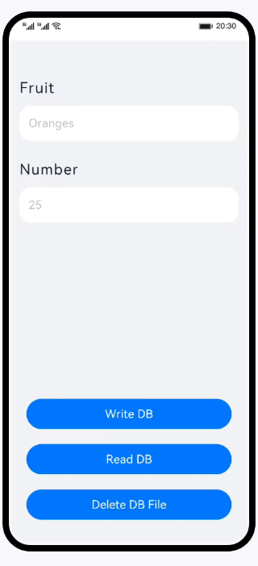

# 首选项（ArkTS）

### 简介

基于首选项，实现对本地应用数据的访问及操作。效果图如下：

### 相关概念

首选项(待官网文档发布后需补充超链接)：为应用提供Key-Value键值型的数据处理能力，支持应用持久化轻量级数据，并对其修改和查询。数据存储形式为键值对，键的类型为字符串型，值的存储数据类型包括数字型、字符型、布尔型以及这3种类型的数组类型。

[TextInput](https://developer.harmonyos.com/cn/docs/documentation/doc-references/ts-basic-components-textinput-0000001333321201)：可以输入单行文本并支持响应输入事件的组件。

[Button](https://developer.harmonyos.com/cn/docs/documentation/doc-references/ts-basic-components-button-0000001281480682)：按钮组件。

### 相关权限

不涉及

### 使用说明

1. 在Fruit和Number文本输入框中，输入对应的水果名称和水果数量，点击**Write DB**按钮，将输入的数据保存到首选项中。
2. 退出应用再重新进入，在Fruit和Number文本输入框中对应显示上一次保存的数据。
3. 点击**Read DB**按钮，在Fruit和Number文本输入框中对应显示上一次保存的数据。
4. 点击**Delete DB File**按钮，Fruit和Number文本输入框中的数据清空，并删除首选项中的数据及对应的数据库文件。

### 约束与限制

1. 本示例仅支持标准系统上运行，支持设备：华为手机或运行在DevEco Studio上的华为手机设备模拟器。
2. 本示例为Stage模型，支持API version 9及以上版本SDK。
3. 本示例需要使用DevEco Studio 3.1 Canary1及以上版本进行编译运行。