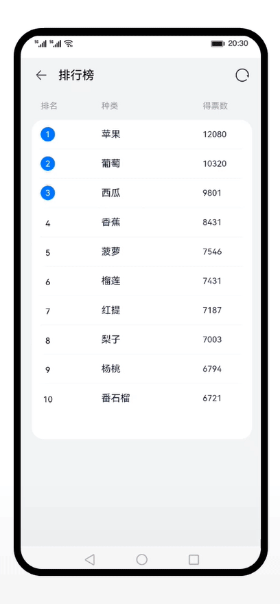

# ArkTS基础知识（ArkTS）
### 简介
使用声明式语法和组件化基础知识，搭建一个可刷新的排行榜页面。效果图如下：

### 相关概念
#### 渲染控制语法
- [条件渲染](https://developer.harmonyos.com/cn/docs/documentation/doc-guides-V3/arkts-rendering-control-ifelse-0000001524177637-V3) ：使用if/else进行条件渲染。
- [循环渲染](https://developer.harmonyos.com/cn/docs/documentation/doc-guides-V3/arkts-rendering-control-foreach-0000001524537153-V3) ：开发框架提供循环渲染（ForEach组件）来迭代数组，并为每个数组项创建相应的组件。
#### [组件化装饰器@Builder](https://developer.harmonyos.com/cn/docs/documentation/doc-guides-V3/arkts-builder-0000001524176981-V3)
- @Builder 装饰的方法用于定义组件的声明式UI描述，在一个自定义组件内快速生成多个布局内容。@Builder装饰方法的功能和语法规范与build函数相同。
#### 组件状态管理器
- [@State](https://developer.harmonyos.com/cn/docs/documentation/doc-guides-V3/arkts-state-0000001474017162-V3)装饰的变量是组件内部的状态数据，当这些状态数据被修改时，将会调用所在组件的build方法进行UI刷新。
- [@Prop](https://developer.harmonyos.com/cn/docs/documentation/doc-guides-V3/arkts-prop-0000001473537702-V3)与@State有相同的语义，但初始化方式不同。@Prop装饰的变量必须使用其父组件提供的@State变量进行初始化，允许组件内部修改@Prop变量，但更改不会通知给父组件，即@Prop属于单向数据绑定。
- [@Link](https://developer.harmonyos.com/cn/docs/documentation/doc-guides-V3/arkts-link-0000001524297305-V3)装饰的变量可以和父组件的@State变量建立双向数据绑定。
#### [组件生命周期函数](https://developer.harmonyos.com/cn/docs/documentation/doc-references-V3/arkts-custom-component-lifecycle-0000001482395076-V3)
- 自定义组件的生命周期回调函数用于通知用户该自定义组件的生命周期，这些回调函数是私有的，在运行时由开发框架在特定的时间进行调用，不能从应用程序中手动调用这些回调函数。 
### 相关权限
不涉及
### 使用说明
1. 点击标题栏返回按钮，退出应用。
2. 点击标题栏刷新按钮，刷新列表数据。
3. 点击排行榜列表中的某一项，列表中的子组件文本颜色会发生变化。
4. 点击系统导航返回按钮，满足退出条件则直接退出，否则，提示再按一次退出程序。
### 约束与限制
1. 本示例仅支持标准系统上运行，支持设备：华为手机或运行在DevEco Studio上的华为手机设备模拟器。
2. 本示例为Stage模型，支持API version 9。
3. 本示例需要使用DevEco Studio 3.1 Release版本进行编译运行。
