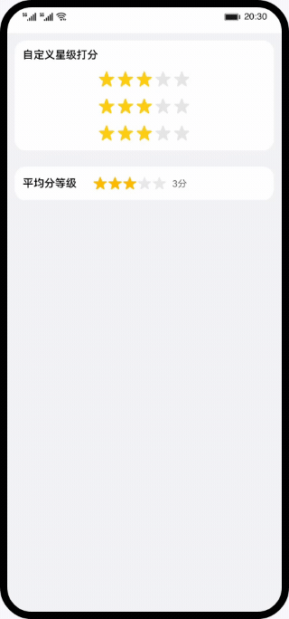

# rating组件的使用（JS）

### 简介

基于rating组件，实现星级打分的效果。效果如图所示：

### 相关概念

- [rating组件](https://developer.harmonyos.com/cn/docs/documentation/doc-references-V3/js-components-basic-rating-0000001477981265-V3?catalogVersion=V3)：评分条，可根据用户判断进行打分。

### 相关权限

不涉及

### 使用说明

1. 在星星上点击改变评分大小，在平均分等级中展示三条rating记录的平均分。

### 约束与限制

1. 本示例仅支持标准系统上运行，支持设备：华为手机或运行在DevEco Studio上的华为手机设备模拟器。
2. 本示例为FA模型，支持API version 9。
3. 本示例需要使用DevEco Studio 3.1 Release版本进行编译运行。