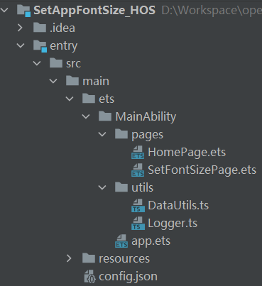
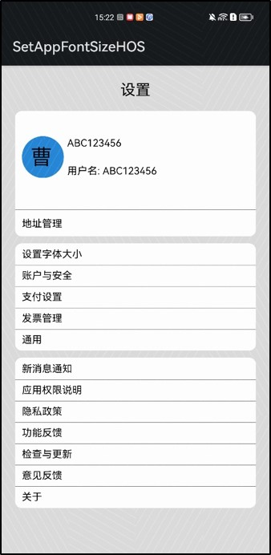
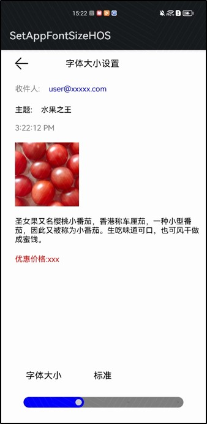

# 介绍<a name="ZH-CN_TOPIC_0000001274574010"></a>

本篇Codelab将介绍如何使用基础组件[Slider](https://developer.harmonyos.com/cn/docs/documentation/doc-references/ts-basic-components-slider-0000001196785701)，通过拖动滑块快速、同步调节应用内字体的大小。要求完成以下功能：

-   实现两个页面，主页面和字体大小调节页面。
-   拖动滑块改变调节系数，列表页和调节页面字体大小同步变化。
-   调节系数支持持久化存储，再次启动时，应用内字体仍是调节后的字体大小。

效果图如下所示：


# 搭建HarmonyOS环境<a name="ZH-CN_TOPIC_0000001325253701"></a>

我们首先需要完成HarmonyOS开发环境搭建，可参照如下步骤进行。

-   安装DevEco Studio，详情请参见[下载和安装软件](https://developer.harmonyos.com/cn/docs/documentation/doc-guides/software_install-0000001053582415)。
-   设置DevEco Studio开发环境，DevEco Studio开发环境需要依赖于网络环境，需要连接上网络才能确保工具的正常使用，可以根据如下两种情况来配置开发环境：
    1.  如果可以直接访问Internet，只需进行[下载HarmonyOS SDK](https://developer.harmonyos.com/cn/docs/documentation/doc-guides/environment_config-0000001052902427)操作。
    2.  如果网络不能直接访问Internet，需要通过代理服务器才可以访问，请参见[配置开发环境](https://developer.harmonyos.com/cn/docs/documentation/doc-guides/environment_config-0000001052902427)。

-   开发者可以参见以下链接，完成设备调试的相关配置：[使用真机进行调试](https://developer.harmonyos.com/cn/docs/documentation/doc-guides/ide_debug_device-0000001053822404)

# 代码结构解读<a name="ZH-CN_TOPIC_0000001274893870"></a>



-   entry/src/main/ets/MainAbility：程序目录。
    -   pages：存放应用页面。
        -   HomePage.ets：应用主页面。
        -   SetFontSizePage.ets：字体大小调节页面。

    -   utils：工具类方法。
        -   DataUtils.ts：保存数据操作方法。
        -   Logger.ts：日志相关操作方法。

    -   app.ets：Ability生命周期。

-   entry/src/main/resources：资源文件目录。
    -   base\>element：包括字符串、整型数、颜色、样式等资源的json文件。
    -   base\>media：多媒体文件，如图形、视频、音频等文件。

-   config.json：模块配置文件。

# 轻量级数据库的使用<a name="ZH-CN_TOPIC_0000001325573733"></a>

-   [默认数据的添加](#section57881535458)
-   [数据的查询：](#section88978371874)
-   [数据的修改：](#section1465174713497)

## 默认数据的添加<a name="section57881535458"></a>

应用初始化时，为了保证页面中文本的正常显示，在系统启动时，生命周期onCreate方法处，添加一个命名为mystery的轻量级数据库表，并在表格中维护如下数据结构：

<a name="table18722154719409"></a>
<table><tbody><tr id="row1723194718404"><th class="firstcol" rowspan="2" valign="top" width="25.567443255674426%" id="mcps1.1.5.1.1"><p id="p182842219326"><a name="p182842219326"></a><a name="p182842219326"></a><strong id="b121691648193211"><a name="b121691648193211"></a><a name="b121691648193211"></a>changeTextSize</strong></p>
<p id="p72841621324"><a name="p72841621324"></a><a name="p72841621324"></a>数据定义</p>
</th>
<td class="cellrowborder" valign="top" width="27.20727927207279%" headers="mcps1.1.5.1.1 "><p id="p7723114754010"><a name="p7723114754010"></a><a name="p7723114754010"></a>字段</p>
</td>
<td class="cellrowborder" valign="top" width="16.3983601639836%" headers="mcps1.1.5.1.1 "><p id="p1972314794011"><a name="p1972314794011"></a><a name="p1972314794011"></a>类型</p>
</td>
<td class="cellrowborder" valign="top" width="30.82691730826917%" headers="mcps1.1.5.1.1 "><p id="p172374718402"><a name="p172374718402"></a><a name="p172374718402"></a>描述</p>
</td>
</tr>
<tr id="row1372374744013"><td class="cellrowborder" valign="top" headers="mcps1.1.5.1.1 "><p id="p1693884175511"><a name="p1693884175511"></a><a name="p1693884175511"></a>changeTextSize</p>
</td>
<td class="cellrowborder" valign="top" headers="mcps1.1.5.1.1 "><p id="p1658914684116"><a name="p1658914684116"></a><a name="p1658914684116"></a>string</p>
</td>
<td class="cellrowborder" valign="top" headers="mcps1.1.5.1.1 "><p id="p0589046134113"><a name="p0589046134113"></a><a name="p0589046134113"></a>字体调节系数</p>
</td>
</tr>
</tbody>
</table>

代码如下所示：

```
export async function saveDefaultSize(defaultFontSize: string) {
  var context = featureAbility.getContext()
  var path = await context.getFilesDir()
  let storage = dataStorage.getStorageSync(path + '/mystery')
  // 检查存储对象是否包含名为changeTextSize的存储
  storage.has('changeTextSize', function (err, isExist) {
    Logger.info(TAG,"storage has changeTextSize is " + isExist)
    if (!isExist) {
      Logger.info(TAG,"saveSize do not has exit...")
      // 保存调节系数
      let promise = storage.put("changeTextSize", defaultFontSize)
      storage.flush()
      promise.then(() => {
        Logger.info(TAG,"Put the value successfully. ")
      }).catch((err) => {
        Logger.info(TAG,"Put the value failed with err: " + err)
      })
    }
  })
}
```

## 数据的查询：<a name="section88978371874"></a>

在app.ets的onCreate方法处已经向轻量级数据库中保存了默认的调节系数值，在应用主页面加载显示的时候，即生命周期onPageShow方法处，需要去读取数据库中的数据。

代码如下所示：

```
async getFontSize() {
  var context = featureAbility.getContext()
  var path = await context.getFilesDir()
  let storage = dataStorage.getStorageSync(path + '/mystery')
  storage.get("changeTextSize", " ")
    .then((value) => {
      // 查询调节系数值
      this.changeTextSize = JSON.parse(value.toString());
      Logger.info(TAG,"Get the value of changeTextSize: " + this.changeTextSize)
    }).catch((err) => {
    Logger.info(TAG,"Get the value of changeTextSize failed with err: " + err)
    this.getFontSize()
})
}
```

## 数据的修改：<a name="section1465174713497"></a>

在应用主页面，点击设置字体大小，可以跳转到字体大小调节页面。通过拖动滑块修改数据后，写入本条数据即可。

代码如下所示：

```
Slider({
  value: this.inSetValue,
    min: 8,
    max: 20,
    step: 4,
    style: SliderStyle.InSet
})
  ...
  .onChange((value: number, mode: SliderChangeMode) => {
    this.inSetValue = value
    this.getText(this.inSetValue)
    // 调节系数
    this.changeTextSize = value * 0.1
    // 保存数据
    saveChangeSize(this.changeTextSize)
    Logger.info(TAG,'value:' + value + 'mode:' + mode.toString())
})

export async function saveChangeSize(changeTextSize: string) {
  var context = featureAbility.getContext()
  var path = await context.getFilesDir()
  let storage = dataStorage.getStorageSync(path + '/mystery')
  // 保存调节系数
  let promise = storage.put("changeTextSize", JSON.stringify(changeTextSize))
  storage.flush()
  promise.then(() => {
    Logger.info(TAG,"save changeTextSize successfully." + changeTextSize)
  }).catch((err) => {
    Logger.info(TAG,this.logTag + "save changeTextSize failed with err: " + err)
  })
}
```

# 主页面<a name="ZH-CN_TOPIC_0000001275053782"></a>



-   整体布局使用Column垂直方向布局容器作为根容器，并设置背景颜色为灰色\(0xDCDCDC\)。
-   上方使用Flex弹性布局容器，设置主轴与行方向一致作为布局模式、子组件在Flex容器主轴和交叉轴上的对齐格式为居中对齐、高度为8%填充。
-   中下方使用ColumnSplit纵向布局容器，设置宽度为90%、并设置背景颜色为白色\(0xFFFFFF\)。
-   将Text组件‘设置字体大小’添加到Navigator组件中，从而实现点击设置字体大小文本跳转到字体大小调节界面。

代码如下所示：

```
build() {
  Column() {
    Flex({ justifyContent: FlexAlign.Center, direction: FlexDirection.Row, alignItems: ItemAlign.Center }) {
      Text('设置')
        .fontSize(18* this.changeTextSize + 'fp')
    }
    .height(60 + 'vp')
    ColumnSplit() {
      Row() {
        Image($r("app.media.head")).width(60 + 'vp').height(60 + 'vp').borderRadius(60).margin({ left: 10 })
        Column() {
          Text('ABC123456').width('100%').height(40 + 'vp').fontSize(12  * this.changeTextSize + 'fp').margin({ left: 10 })
          Text('用户名: ABC123456').width('100%').height(40 + 'vp').fontSize(12  * this.changeTextSize + 'fp').margin({ left: 10})
        }
      }.margin({ bottom: 12 }).height('70%')
      Text('地址管理').width('100%').height(30 + 'vp').fontSize(12  * this.changeTextSize + 'fp').margin({ left: 10, top: 5})
    }.width('90%').height(180 + 'vp').borderRadius(10).backgroundColor(0xFFFFFF)

    ColumnSplit() {
      // 跳转到字体大小调节页面
      Navigator({ target: 'pages/SetFontSizePage' }) {
        Text('设置字体大小').width('100%').height(30 + 'vp').fontSize(12 * this.changeTextSize + 'fp').margin({ left: 10 })
      }
      ForEach(this.firstArr, (item) => {
        Text(item).width('100%').height(30 + 'vp').fontSize(12  * this.changeTextSize + 'fp').margin({ left: 10 })
      })
    }.width('90%').height(154 + 'vp').margin({top: 10 }).borderRadius(10).backgroundColor(0xFFFFFF)

    ColumnSplit() {
      ForEach(this.secondArr, (item) => {
        Text(item).width('100%').height(30 + 'vp').fontSize(12  * this.changeTextSize + 'fp').margin({ left: 10 })
      })
    }.width('90%').height(216 + 'vp').margin({top: 10 }).borderRadius(10).backgroundColor(0xFFFFFF)
  }.width('100%').height('100%').backgroundColor(0xDCDCDC).padding({ top: 5 })
}
```

# 字体大小调节页面<a name="ZH-CN_TOPIC_0000001274733902"></a>



1.  整体布局使用Flex弹性布局容器作为根容器，设置主轴与列方向一致作为布局模式、元素在主轴方向首端对齐、宽度为100%、高度为100%。
2.  上方使用Flex弹性布局容器，左侧摆放Image组件展示返回图标，中间摆放Text组件展示标题文本。点击返回图标，跳转到主页面。
3.  中间使用Row水平方向布局容器和Column垂直方向布局容器，展示收件人、主题、时间和商品等信息。
4.  下方使用Slider滑动条组件，通过调节滑动条的数值，改变应用字体的大小。

代码如下所示：

```
build() {
  Flex({ justifyContent: FlexAlign.Start, direction: FlexDirection.Column }) {
    Flex({ justifyContent: FlexAlign.Start, direction: FlexDirection.Row, alignItems: ItemAlign.Start }) {
      Image($r("app.media.ic_public_back"))
        .width(45)
        .height(30)
        .margin({ left: 16, top:10 })
        .objectFit(ImageFit.Contain)
        .onClick(() => {
          // 返回主页面
          router.back()
        })
      Text('字体大小设置')
        .fontSize(14 * this.changeTextSize + 'fp').height(30).margin({ left: 60, top:10 })
    }.height('6%')

    Row() {
      Text('收件人:')
        .fontSize(12 * this.changeTextSize + 'fp')
        .fontColor(Color.Gray)
        .margin({ left: 26 })
      Text('user@xxxxx.com')
        .fontSize(12 * this.changeTextSize + 'fp')
        .fontColor(Color.Blue)
        .margin({ left: 16 })
    }.height('5%').width('100%').margin({ top:10 })

    Row() {
      Text('主题:')
        .fontSize(12 * this.changeTextSize + 'fp')
        .fontColor(Color.Black)
        .margin({ left: 26 })
      Text('水果之王')
        .fontSize(12 * this.changeTextSize + 'fp')
        .fontColor(Color.Black)
        .margin({ left: 16 })
    }.height('5%').width('100%')

    Row() {
      Text(new Date().toLocaleTimeString())
        .fontSize(12 * this.changeTextSize + 'fp')
        .fontColor(Color.Gray)
        .margin({ left: 26 })
    }.height('5%').width('100%')

    Column() {
      Image($r("app.media.img"))
        .width(100 * this.changeTextSize).height(100 * this.changeTextSize).margin({ left: 26, right: 20, top:10 })
      Text("圣女果又名樱桃小番茄,香港称车厘茄,一种小型番茄,因此又被称为小番茄.生吃味道可口,也可风干做成蜜饯.")
        .fontSize(12 * this.changeTextSize + 'fp')
        .margin({left: 26, top: 20, bottom: 20 })

      Text("优惠价格：xxx")
        .fontSize(12 * this.changeTextSize + 'fp')
        .fontColor(Color.Red)
        .margin({left: 26 })

    }.alignItems(HorizontalAlign.Start).width('100%').height('60%')

    Row() {
      Column() {
        Row() {
          Text('字体大小').fontSize(14 * this.changeTextSize + 'fp').margin({ left:8 })
          Text(this.text).fontSize(14 * this.changeTextSize + 'fp').margin({ left:60 })
        }.width('80%')
        Slider({
          ...
        })  
      }.width('100%').alignItems(HorizontalAlign.Center)
    }.height('20%')
  }.width('100%').height('100%')
}
```

# 恭喜您<a name="ZH-CN_TOPIC_0000001276663826"></a>

通过本Codelab的学习，您已经学会了：

-   轻量级数据库的使用，如添加、修改、查询等基础操作。
-   应用生命周期的使用，如onCreate、onPageShow等。
-   基础组件的使用，如Text文本、Image图片、Slider滑动条组件等。
-   容器组件的使用，如Column、ColumnSplit、Row、Flex等。

# 参考<a name="ZH-CN_TOPIC_0000001327383725"></a>

gitee

