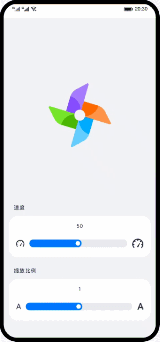

# slider组件的使用（JS）

### 简介

基于slider组件，实现调节风车大小和转动速度的动画效果。效果如图所示：

### 相关概念

- [slider组件](https://developer.harmonyos.com/cn/docs/documentation/doc-references-V3/js-components-basic-slider-0000001427744892-V3?catalogVersion=V3)：滑动条组件，用来快速调节设置值，如音量、亮度等。

### 相关权限

不涉及

### 使用说明

1. 拖动缩放比例滑动条，调节风车大小。拖动速度滑动条，调节风车转动速度。

### 约束与限制

1. 本示例仅支持标准系统上运行，支持设备：华为手机或运行在DevEco Studio上的华为手机设备模拟器。
2. 本示例为FA模型，支持API version 9。
3. 本示例需要使用DevEco Studio 3.1 Release版本进行编译运行。