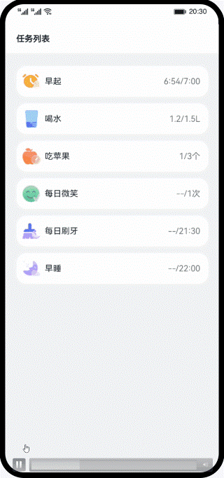

# 常用组件和容器低代码开发示例（ArkTS）

### 简介
基于ArkTS语言的低代码开发方式，利用常用组件实现任务列表和任务信息的页面展示。效果图如下：

### 相关概念

低代码开发方式具有丰富的UI界面编辑功能，通过可视化界面开发方式快速构建布局，可有效降低开发者的上手成本并提升开发者构建UI界面的效率。

[List](https://developer.harmonyos.com/cn/docs/documentation/doc-references/ts-container-list-0000001333800573) ：列表包含一系列相同宽度的列表项。适合连续、多行呈现同类数据，例如图片和文本。

[循环渲染](https://developer.harmonyos.com/cn/docs/documentation/doc-guides/ts-rending-control-syntax-foreach-0000001333721033) ： 开发框架提供循环渲染（ForEach组件）来迭代数组，并为每个数组项创建相应的组件。

[警告弹窗](https://developer.harmonyos.com/cn/docs/documentation/doc-references/ts-methods-alert-dialog-box-0000001281201174) ：显示警告弹窗组件，可设置文本内容与响应回调。

### 相关权限

不涉及

### 使用说明
1. 点击应用进入任务列表。
2. 点击任务列表中的任务信息，跳转到任务信息界面。
3. 任务信息页面主要有上边的任务信息和底部的打卡按钮组成，点击打卡按钮弹出打卡成功的弹窗。
4. 点击返回按钮，回到任务列表页面

### 约束与限制
1. 本示例仅支持标准系统上运行，支持设备：华为手机或运行在DevEco Studio上的华为手机设备模拟器。
2. 本示例为Stage模型，支持API Version 9及以上版本SDK。
3. 本示例需要使用DevEco Studio 3.1 Canary1及以上版本进行编译运行。