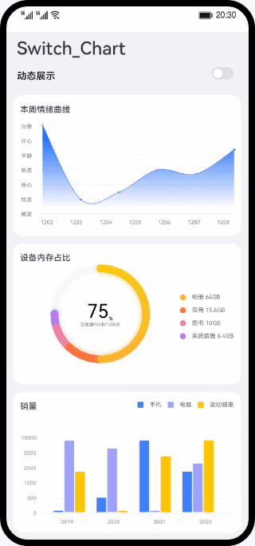

# switch、chart组件的使用（JS）

## 简介
基于switch、chart组件，实现可静态或动态显示的图表数据可视化案例。

## 相关概念

- [switch组件](https://developer.harmonyos.com/cn/docs/documentation/doc-references-V3/js-components-basic-switch-0000001478341221-V3?catalogVersion=V3&ha_linker=eyJ0cyI6MTY4NDg5NjU4NjE1NSwiaWQiOiIwMjdlOTVmM2UxOGVmMGQ4YmZmYjkwN2EyYzFlYTg0NCJ9): 开关选择器，通过开关，开启或关闭某个功能。
- [chart组件](https://developer.harmonyos.com/cn/docs/documentation/doc-references-V3/js-components-basic-chart-0000001428061800-V3?catalogVersion=V3&ha_linker=eyJ0cyI6MTY4NDg5NjYyNjA3NSwiaWQiOiIwMjdlOTVmM2UxOGVmMGQ4YmZmYjkwN2EyYzFlYTg0NCJ9): 图表组件，用于呈现线形图、占比图、柱状图界面。

## 相关权限

不涉及

## 使用说明

1. 进入应用首页，打开动态展示开关，图表动态显示。
2. 关闭动态展示开关，图表静态显示。

## 约束与限制

1. 本示例仅支持标准系统上运行，支持设备：华为手机或运行在DevEco Studio上的华为手机设备模拟器。
2. 本示例为FA模型，支持API version 9及以上版本SDK。
3. 本示例需要使用DevEco Studio 3.1 Release及以上版本进行编译运行。