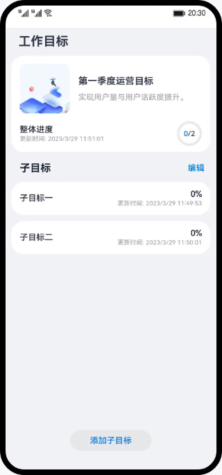

# 目标管理（ArkTS）

## 简介
本篇Codelab基于ArkTS实现一个目标管理器，介绍页面级变量的状态管理。效果图如下：

## 相关概念
- [页面状态管理](https://developer.harmonyos.com/cn/docs/documentation/doc-guides-V3/arkts-state-management-overview-0000001524537145-V3?catalogVersion=V3): 用于管理页面级变量的状态。

- [自定义弹窗](https://developer.harmonyos.com/cn/docs/documentation/doc-references-V3/ts-methods-custom-dialog-box-0000001477981237-V3?catalogVersion=V3): 通过CustomDialogController类显示自定义弹窗。

- [List列表](https://developer.harmonyos.com/cn/docs/documentation/doc-references-V3/ts-container-list-0000001477981213-V3?catalogVersion=V3): 列表包含一系列相同宽度的列表项。

## 相关权限

不涉及

## 使用说明

1. 打开应用首页，点击主页添加子目标按钮，展示添加子目标弹窗，点击取消按钮关闭弹窗，或者确定按钮保存数据。
2. 打开应用首页，点击列表项展开卡片，调节进度，点击确定按钮，卡片收起，保存调节的进度值，进度值为100%时，卡片置灰。
3. 打开应用首页，点击编辑按钮，展示多选框，勾选需要删除的卡片，点击删除按钮，数据被删除。

## 约束与限制

1. 本示例仅支持标准系统上运行，支持设备：华为手机或运行在DevEco Studio上的华为手机设备模拟器。
2. 本示例为Stage模型，支持API version 9。
3. 本示例需要使用DevEco Studio 3.1 Release版本进行编译运行。