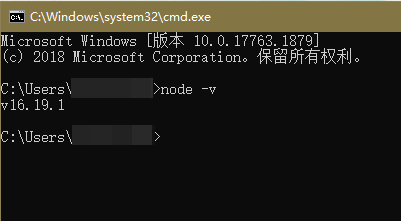
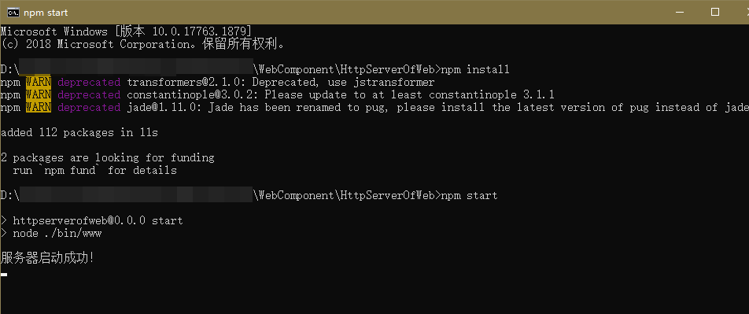

# Web组件抽奖案例（ArkTS）

## 简介

本篇Codelab是基于ArkTS的声明式开发范式的样例，主要介绍了Web组件如何加载本地和云端H5小程序。

## 相关概念

- [Web](https://developer.harmonyos.com/cn/docs/documentation/doc-references-V3/ts-basic-components-web-0000001477981205-V3?catalogVersion=V3)：提供具有网页显示能力的Web组件。
- [runJavaScript](https://developer.harmonyos.com/cn/docs/documentation/doc-references-V3/js-apis-webview-0000001427902720-V3#ZH-CN_TOPIC_0000001523968634__runjavascript)：异步执行JavaScript脚本，并通过回调方式返回脚本执行的结果。
- [onConfirm](https://developer.harmonyos.com/cn/docs/documentation/doc-references-V3/ts-basic-components-web-0000001477981205-V3?catalogVersion=V3#ZH-CN_TOPIC_0000001523968730__onconfirm)：网页调用confirm()告警时触发此回调。本篇Codelab用于回显抽奖结果。

## 相关权限

访问在线网页时需添加网络权限：ohos.permission.INTERNET。

## 使用说明

#### 服务端搭建流程

1. 搭建nodejs环境：本篇Codelab的服务端是基于nodejs实现的，需要安装nodejs，如果您本地已有nodejs环境可以跳过此步骤。

   1. 检查本地是否安装nodejs：打开命令行工具（如Windows系统的cmd和Mac电脑的Terminal，这里以Windows为例），输入node -v，如果可以看到版本信息，说明已经安装nodejs。
      
      
      
   2. 如果本地没有nodejs环境，您可以去nodejs官网上下载所需版本进行安装配置。

   3. 配置完环境变量后，重新打开命令行工具，输入node -v，如果可以看到版本信息，说明已安装成功。

2. 运行服务端代码：在本项目的HttpServerOfWeb目录下打开命令行工具，输入npm install 安装服务端依赖包，安装成功后输入npm start点击回车。看到“服务器启动成功！"则表示服务端已经在正常运行。
   
   
   
3. 构建局域网环境：测试本Codelab时要确保运行服务端代码的电脑和测试机连接的是同一局域网下的网络，您可以用您的手机开一个个人热点，然后将测试机和运行服务端代码的电脑都连接您的手机热点进行测试。

4. 连接服务器地址：打开命令行工具，输入ipconfig命令查看本地ip，将本地ip地址复制到entry/src/main/ets/common/constants/Constants.ets文件下的23行，注意只替换ip地址部分，不要修改端口号，保存好ip之后即可运行Codelab进行测试。

#### 前端使用说明

1. 点击应用进入主页面，页面提供两个按钮，分别对应加载本地H5和加载云端H5，点击按钮跳转到抽奖页面，Web组件会加载H5抽奖小程序。
2. 抽奖页面主要是由“点击抽奖”按钮和Web组件构成。给“点击抽奖”按钮绑定点击事件，实现点击按钮调用H5页面的抽奖函数，并且通过onConfirm回调返回抽奖结果，在原生页面弹窗显示。
3. 点击返回键，回到应用主页面。

## 约束与限制

1. 本示例仅支持标准系统上运行，支持设备：华为手机或运行在DevEco Studio上的华为手机设备模拟器。
2. 本示例为Stage模型，支持API version 9及以上版本SDK。
3. 本示例需要使用DevEco Studio 3.1 Release及以上版本进行编译运行。