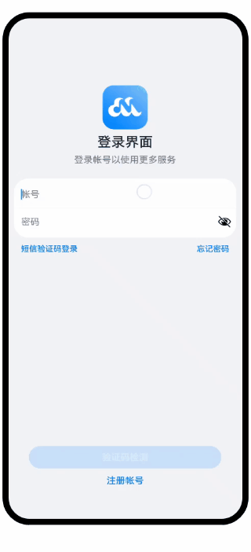

# 窗口管理（ArkTS）

### 简介
本篇Codelab基于窗口管理，实现一个验证码登录案例。效果图如下：

### 相关概念

- [主窗口](https://developer.harmonyos.com/cn/docs/documentation/doc-guides-V3/application-window-stage-0000001427584712-V3?catalogVersion=V3#ZH-CN_TOPIC_0000001523968638__%E8%AE%BE%E7%BD%AE%E5%BA%94%E7%94%A8%E4%B8%BB%E7%AA%97%E5%8F%A3) ： 应用主窗口用于显示应用界面，会在"任务管理界面"显示。
- [子窗口](https://developer.harmonyos.com/cn/docs/documentation/doc-guides-V3/application-window-stage-0000001427584712-V3?catalogVersion=V3#ZH-CN_TOPIC_0000001523968638__%E8%AE%BE%E7%BD%AE%E5%BA%94%E7%94%A8%E5%AD%90%E7%AA%97%E5%8F%A3) ：应用子窗口用于显示应用的弹窗、悬浮窗等辅助窗口。
- [沉浸式](https://developer.harmonyos.com/cn/docs/documentation/doc-guides-V3/application-window-stage-0000001427584712-V3?catalogVersion=V3#ZH-CN_TOPIC_0000001523968638__%E4%BD%93%E9%AA%8C%E7%AA%97%E5%8F%A3%E6%B2%89%E6%B5%B8%E5%BC%8F%E8%83%BD%E5%8A%9B) ：指对状态栏、导航栏等系统窗口进行控制，减少状态栏导航栏等系统界面的突兀感，从而使用户获得最佳体验的能力。

### 相关权限

不涉及

### 使用说明

1. 打开应用，主窗口实现沉浸式。
2. 输入用户名密码后，点击验证码登录，拉起验证码校验子窗口。
3. 验证码校验成功后，等待两秒，验证码校验子窗口消失，主窗口跳转到应用首页。

### 约束与限制

1. 本示例仅支持标准系统上运行，支持设备：华为手机或运行在DevEco Studio上的华为手机设备模拟器。
2. 本示例为Stage模型，支持API version 9。
3. 本示例需要使用DevEco Studio 3.1 Release版本进行编译运行。