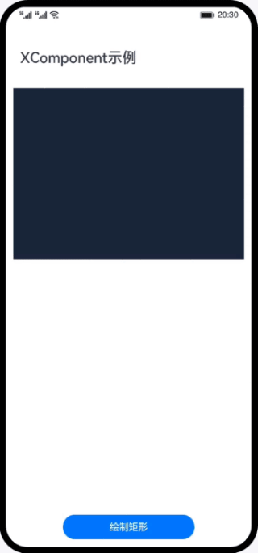

# Native XComponent组件的使用（ArkTS）
### 简介
本篇Codelab主要介绍如何使用XComponent组件调用Native API来创建EGL/GLES环境，从而使用标准OpenGL ES进行图形渲染。使用OpenGL ES实现在主页面绘制区域中渲染一个正方形，点击绘制区域可以改变正方形的颜色。界面效果如图所示：

### 相关概念
- [EGL(Embedded Graphic Library)](https://developer.harmonyos.com/cn/docs/documentation/doc-references-V3/musl-0000001478181805-V3#ZH-CN_TOPIC_0000001523489066__egl)：EGL 是Khronos渲染API (如OpenGL ES 或 OpenVG) 与底层原生窗口系统之间的接口。
- [XComponent](https://developer.harmonyos.com/cn/docs/documentation/doc-references-V3/_o_h___native_x_component-0000001497210885-V3?catalogVersion=V3)：可用于EGL/OpenGLES和媒体数据写入，并显示在XComponent组件。

### 相关权限
不涉及
### 使用说明
1. 点击“绘制矩形”按钮，界面绘制区域中渲染出一个正方形，点击绘制区域，正方形切换显示另一种颜色，点击绘制矩形按钮还原按钮绘制的颜色。
### 约束与限制
1. 本示例仅支持标准系统上运行，支持设备：华为手机或运行在DevEco Studio上的华为手机设备模拟器。
2. 本示例为Stage模型，支持API version 9及以上版本SDK。
3. 本示例需要使用DevEco Studio 3.1 Release及以上版本进行编译运行。